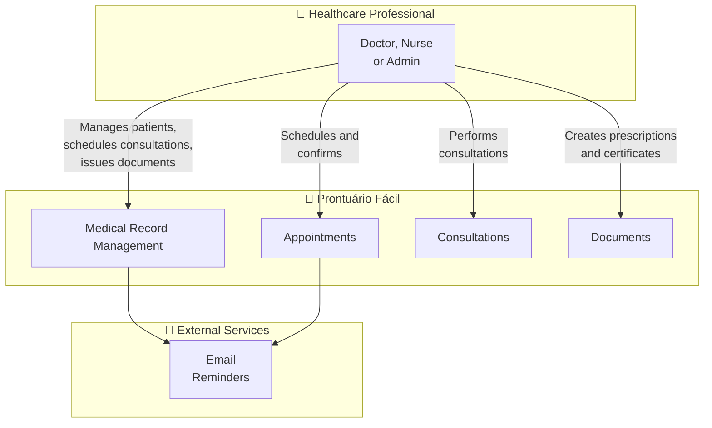
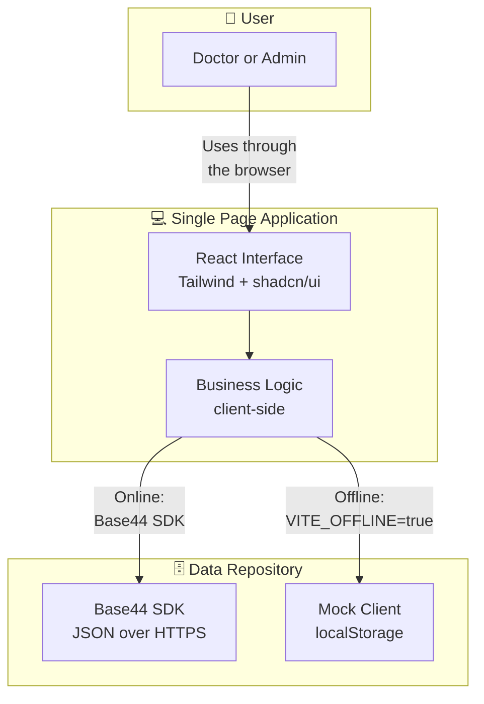
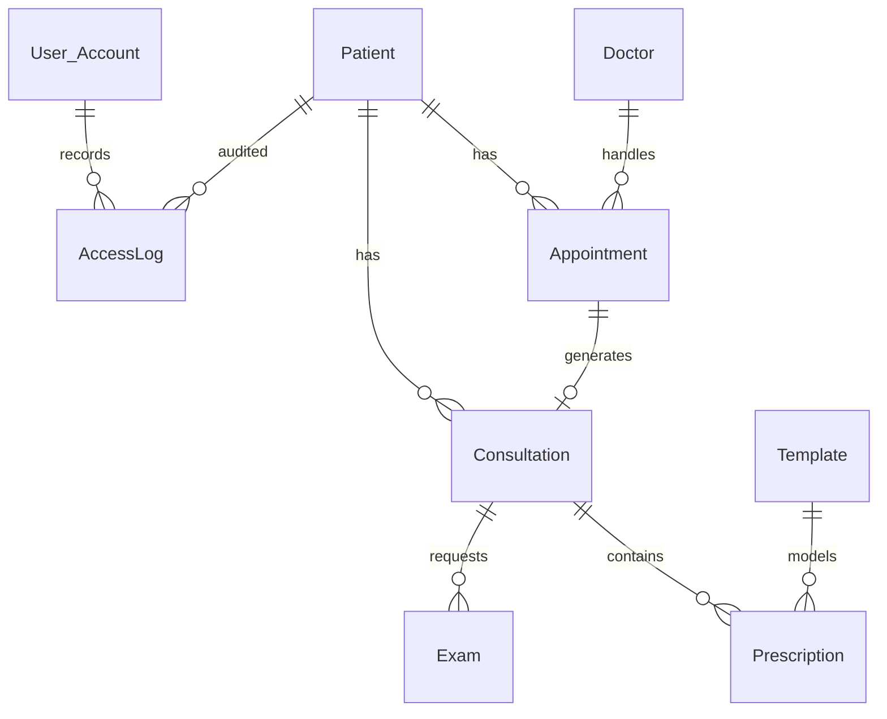
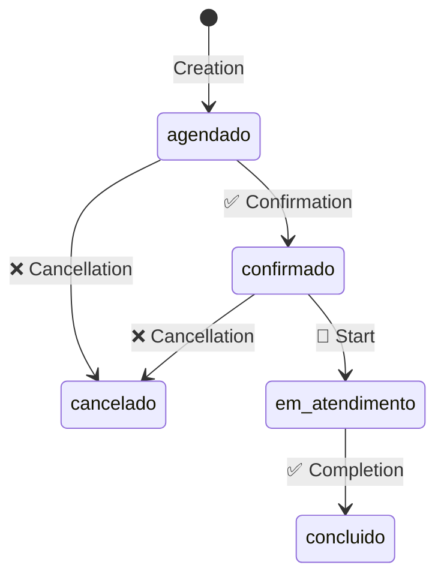

<div align="center">

# Prontuário Fácil

**LGPD-compliant Electronic Medical Record for Medical Clinics**

Complete management of patients, consultations, appointments, examinations, and prescriptions.


<div style="text-align: center; margin-bottom: 20px;">
  <a href="./README.md">
    
  </a>
</div>

</div>

---

## About

**Prontuário Fácil** is a Single Page Application built with React/Vite that works as an electronic medical record system designed with LGPD compliance in mind for medical clinics. Its goal is to provide centralized management of patients, consultations, appointments, and examinations for physicians and clinic administrators.

> **Note:** This application was developed on the [Base44](https://base44.com) platform with the assistance of artificial intelligence. The original template README mentioned Supabase, but the backend is entirely managed by Base44 (BaaS).

---

## Technology Stack

| Layer | Technology | Version |
|--------|-----------|--------|
| **Frontend** | React | 18.2 |
| **Language** | TypeScript | 5.8 |
| **Build** | Vite | 6.1 |
| **Styling** | Tailwind CSS | 3.4 |
| **Components** | Radix UI (shadcn/ui) | — |
| **State** | TanStack React Query | 5.84 |
| **Routing** | React Router DOM | 7.18 |
| **Forms** | React Hook Form + Zod | 7.54 / 3.24 |
| **Charts** | Recharts | 2.15 |
| **Animations** | Framer Motion | 11.16 |
| **Maps** | React Leaflet | 4.2 |
| **PDF** | jsPDF + html2canvas | 4.2 / 1.4 |
| **Backend** | Base44 SDK (BaaS) | 0.8.43 |

---

## Architecture

### Context Diagram



### Container Diagram



> **Offline Mode:** When `VITE_OFFLINE=true`, the application replaces the Base44 SDK with a mock client (`src/api/mockClient.ts`) that persists data in the browser's `localStorage`. Same UI, same architecture, different data repository.

---

## Features

| Module | Description |
|--------|-------------|
| **Patients** | Full CRUD, active/inactive status, LGPD fields (consent, encrypted CPF) |
| **Appointments** | Calendar, time-slot selection, status flow (scheduled → confirmed → in consultation → completed) |
| **Consultations** | Medical history, vital signs, ICD-10 diagnosis, consultation timeline |
| **Templates** | Document templates (prescriptions, certificates, reports) with type filtering |
| **Prescriptions** | Prescription editor with medication list (name, dosage, frequency, duration) |
| **Examinations** | Upload and management of laboratory reports |
| **Dashboard** | Metrics: today's consultations, appointments, attendance rate, charts |
| **Access Logs** | LGPD audit trail — sensitive access is recorded |
| **Offline Mode** | Local mock enabled by environment variable for demos and development without a backend |

---

## Project Structure

```text
prontuario-facil/
├── base44/                    # Base44 platform configuration
│   ├── config.jsonc           # App name and build commands
│   └── entities/              # BaaS entity schemas
│       ├── Patient.jsonc
│       ├── Doctor.jsonc
│       ├── Appointment.jsonc
│       ├── Consultation.jsonc
│       ├── Exam.jsonc
│       ├── Prescription.jsonc
│       ├── Template.jsonc
│       └── AccessLog.jsonc
├── src/
│   ├── api/                   # Typed data access layer
│   │   ├── base44Client.ts    # Base44 SDK client (online)
│   │   ├── mockClient.ts      # Local mock (offline)
│   │   ├── mockSeed.ts        # Demo data
│   │   ├── contract.ts        # Typed data access contract
│   │   ├── registry.ts        # Entity registry (entry point)
│   │   ├── scopedRead.ts      # Owner-scoped reads
│   │   ├── sessionScope.ts    # Session resolution
│   │   └── entities.ts        # Entity binding
│   ├── types/                 # TypeScript type definitions
│   │   ├── base.ts            # BaseEntity
│   │   ├── common.ts          # Shared types
│   │   ├── Patient.ts
│   │   ├── Appointment.ts
│   │   ├── Consultation.ts
│   │   ├── Doctor.ts
│   │   ├── Prescription.ts
│   │   ├── Exam.ts
│   │   ├── Template.ts
│   │   ├── AccessLog.ts
│   │   └── User.ts
│   ├── components/
│   │   ├── appointments/      # .tsx — Calendar, time-slot selection
│   │   ├── medical/           # .ts/.tsx — Clinical components
│   │   └── ui/                # shadcn/ui (~60 components, excluded from typecheck)
│   ├── lib/
│   │   ├── AuthContext.tsx    # Authentication context
│   │   ├── session.ts         # Session conversion
│   │   └── utils.ts           # Utilities (cn())
│   ├── pages/                 # .tsx — Application screens
│   ├── App.tsx                # Root with providers and routes
│   ├── Layout.tsx             # Navigation layout
│   └── pages.config.ts        # Central page/route map
├── _reversa_sdd/              # Complete documentation (Reversa v1.3.2)
│   ├── c4-context.md          # C4 Level 1 — Context
│   ├── c4-containers.md       # C4 Level 2 — Containers
│   ├── c4-components.md       # C4 Level 3 — Components
│   ├── erd-complete.md        # Complete ERD (9 entities)
│   ├── migration/             # TypeScript migration documentation
│   ├── screens/               # Screen inventory
│   └── traceability/          # Specification↔code traceability
├── _reversa_forward/          # Implementation tracking
│   └── 001-migracao-typescript/
├── _reversa_docs/             # Visual mini-site (GitHub Pages)
├── docs/
│   └── security-audit/        # Security audits
│       ├── 001-record/        # Pre-migration (JS)
│       └── 002-record/        # Post-migration (TypeScript)
├── guardrails/                # Prompt injection protection
├── .agents/skills/            # Reversa framework skills
├── .github/
│   ├── skills/                # Audit and convention skills
│   └── workflows/
│       └── deploy-pages.yml   # Mini-site deployment
├── tsconfig.json              # TypeScript configuration (strict: true)
├── package.json
├── tailwind.config.js
└── vite.config.js
```

---

## Data Model

<div align="center" style="margin-right: 80px; min-height: 1000px;">



</div>

---

## Business Rules

### Patient Management

- Only patients with `active` status can be selected for new appointments or consultations.
- CPF is stored in encrypted form.
- LGPD fields include `lgpd_consent`, `lgpd_consent_date`, and `lgpd_consent_ip`.

### Appointment Flow



### Access Control (RBAC)

| Entity | Create | Read | Update | Delete |
|----------|--------|------|--------|--------|
| Patient | Authenticated | `created_by_id` or admin | `created_by_id` or admin | `created_by_id` or admin |
| Appointment | Authenticated | `created_by_id` or admin | `created_by_id` or admin | `created_by_id` or admin |
| Consultation | Authenticated | `created_by_id` or admin | `created_by_id` or admin | `created_by_id` or admin |
| Doctor | Admin | Public | Admin | Admin |
| Template | Admin | Healthcare professionals | Admin | Admin |
| AccessLog | System | Admin | Admin | Admin |

---

## Complete Documentation

This project includes detailed documentation generated by the **Reversa** reverse-engineering framework (v1.3.2), available in `_reversa_sdd/`.

### Architecture (C4)

| Artifact | Description |
|----------|-------------|
| `c4-context.md` | Context diagram (Level 1) — system, personas, and integrations |
| `c4-containers.md` | Container diagram (Level 2) — SPA, data repository, and offline variant |
| `c4-components.md` | Component diagram (Level 3) — internal decomposition of the SPA |

### Data Model

| Artifact | Description |
|----------|-------------|
| `erd-complete.md` | Complete ERD with 9 entities, attributes, and cardinalities |
| `data-dictionary.md` | Data dictionary by entity |
| `database/` | ERD diagrams, relationships, and business rules |

### Analysis and Traceability

| Artifact | Description |
|----------|-------------|
| `inventory.md` | Complete project inventory |
| `soul.md` | Executive summary and foundational decisions |
| `domain.md` | Business rules and glossary |
| `code-analysis.md` | Module-by-module analysis |
| `code-spec-matrix.md` | Code↔specification mapping |
| `traceability/spec-impact-matrix.md` | Impact matrix across modules |
| `permissions.md` | RBAC permission matrix |
| `state-machines.md` | State machines |
| `confidence-report.md` | Documentation confidence report |

### Documented Modules

Each module has complete specs in `_reversa_sdd/[module]/`:

- `requirements.md` — Functional requirements
- `design.md` — Technical design decisions
- `tasks.md` — Implementation plan
- `screens.md` — Screen specifications

### Implementation Tracking
| Artifact | Description |
|----------|-------------|
| `_reversa_forward/` | Records of actions, evidence, and validation proofs for each feature |


| Artifact | Description |
|----------|-------------|
| `migration/paradigm_decision.md` | Paradigm decision (JS→TS, no rewrite) |
| `migration/migration_strategy.md` | Migration strategy |
| `migration/risk_register.md` | Risk register |
| `migration/parity_specs.md` | Parity specifications |
| `addenda/001-migracao-typescript.md` | Formal migration addendum |
| `_reversa_forward/001-migracao-typescript/` | 44 completed actions, 55 test scenarios |

---

## Security

The project underwent **two** automated security audits:
- **001-record** (09/04/2026) — pre-migration JavaScript
- **002-record** (09/16/2026) — post-migration TypeScript

### Findings Summary

| Severity | Count | Description |
|------------|------:|-------------|
| 🟠 **High** | 3 | Admin routes without RBAC, token in URL, IDOR |
| 🟡 **Medium** | 1 | Queries without tenant filtering |
| 🔵 **Low** | 1 | `dangerouslySetInnerHTML` in a component |

### Main Findings

| ID | Severity | Category | Description |
|----|----------|----------|-------------|
| F-01 | 🟠 High | Browser-side authorization | Admin routes (AccessLogs, Doctors, Templates) are exposed to all authenticated users without role verification |
| F-02 | 🟠 High | Exposed credentials | Access token is passed through the URL query string without removal |
| F-03 | 🟠 High | IDOR | Direct access to resources (Patient, Consultation) through an `id` URL parameter without ownership validation |
| F-04 | 🟡 Medium | Data isolation | Broad queries in Patient, Consultation, and Prescription without organization/tenant filtering |
| F-05 | 🔵 Low | XSS | Use of `dangerouslySetInnerHTML` in `src/components/ui/chart.jsx` |

### Strengths
- ✅ Post-migration integrity and functional parity ensured via automated proof cycle
- ✅ Authentication and session centralized through `base44.auth.me()`
- ✅ LGPD audit trail with access events recorded in `AccessLog`
- ✅ Secure communication through the official `@base44/sdk`
- ✅ Encapsulated offline mode for development and testing
- ✅ Typed ownership isolation via `OwnedEntity` / `resolveScope`
- ✅ Structured LGPD audit logging (`AccessLogger.ts`)
- ✅ Session sanitization with role validation (`session.ts`)
- ✅ Explicit LGPD consent component (`LGPDConsent.tsx`)

> **Complete reports:**
> - `docs/security-audit/001-record/relatorio-auditoria-seguranca.md` (pre-migration)
> - `docs/security-audit/002-record/relatorio-auditoria-seguranca.md` (post-migration)

---

## Contributing

1. Fork the repository.
2. Create a feature branch (`git checkout -b feature/new-feature`).
3. Commit your changes (`git commit -m 'Add new feature'`).
4. Push the branch (`git push origin feature/new-feature`).
5. Open a Pull Request.

### Conventions

- **Commits:** Follow the project conventions (see `.github/skills/`).
- **Code:** Use shadcn/ui components whenever possible.
- **Styling:** Prefer Tailwind utility classes over custom CSS.
- **Types:** Project uses `strict: true` — all new code must be TypeScript.
- **Tests:** 26 Gherkin parity scenarios in `_reversa_sdd/migration/parity_tests/`.

### Before Submitting

- Run `npm run lint` and `npm run typecheck`.
- Check for security regressions (see the **Security** section).
- For a complete audit, use the `security-code-audit` skill (`.github/skills/security-code-audit/`).

---

## Known Issues

| Item | Status | Description |
|------|--------|-------------|
| **CI/CD** | ✅ GitHub Actions | Mini-site deployment (`_reversa_docs/`) to GitHub Pages |
| **TypeScript** | ✅ Active | `strict: true` — 0 type errors, `tsc --noEmit` gate |
| **Automated tests** | ✅ Structured | Proof cycle (002 to 010) validating KPIs, Data Contract, and Offline Mode via GitHub Actions |
| **Frontend RBAC** | ⚠️ Partial | Admin routes exposed without role verification (see F-01) |
| **Unused dependencies** | ⚠️ Present | Stripe and react-leaflet included in `package.json` but not used in `src/` |

---

## Getting Started

### Prerequisites

- Node.js 18+
- npm or yarn

### Installation

```bash
# Clone the repository
git clone https://github.com/Adriano1976/prontuario-facil.git
cd prontuario-facil

# Install dependencies
npm install
```

### Environment Variables

Create a `.env.local` file in the project root:

```env
# Base44 configuration (required for online mode)
VITE_BASE44_APP_ID=your_app_id
VITE_BASE44_APP_BASE_URL=https://your-app.base44.app

# Offline mode (optional — uses local mock instead of the backend)
VITE_OFFLINE=true
```

**Query string parameters** (alternative to `.env.local`):

- `app_id` — Application ID
- `access_token` — Access token
- `app_base_url` — Backend base URL

### Available Scripts

```bash
npm run dev        # Start the development server
npm run build      # Generate a production build
npm run preview    # Preview the production build locally
npm run lint       # Check for code issues
npm run lint:fix   # Automatically fix lint issues
npm run typecheck  # Validate types with TypeScript
```

### Running the App

After running `npm run dev`, open:

```text
http://localhost:5173
```

---

## License

MIT

---

<div align="center">
  <p><b>Visitor count</b></p>
  
  <br>
  
</div>
