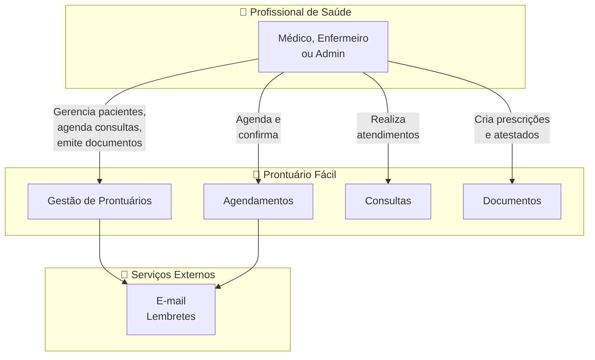
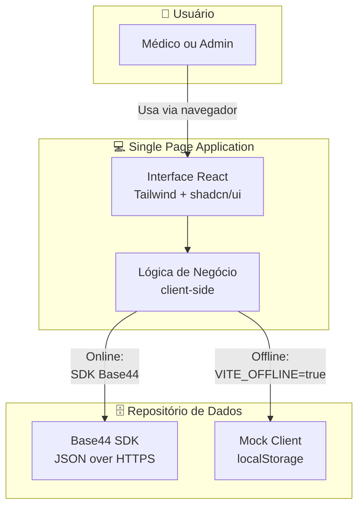
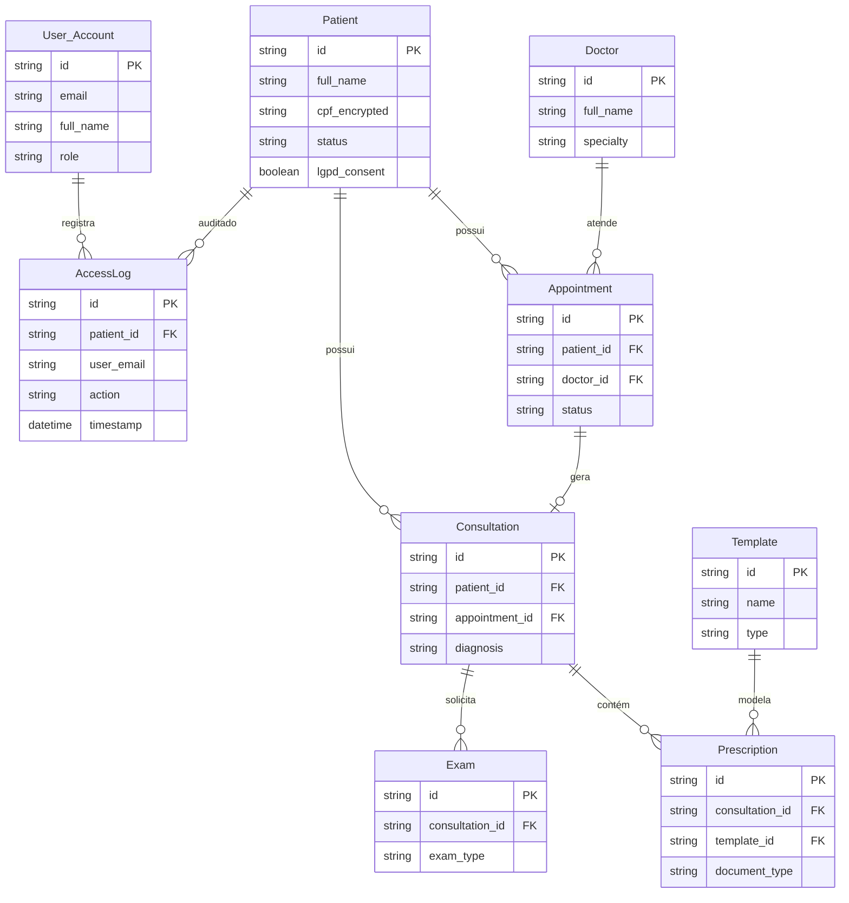
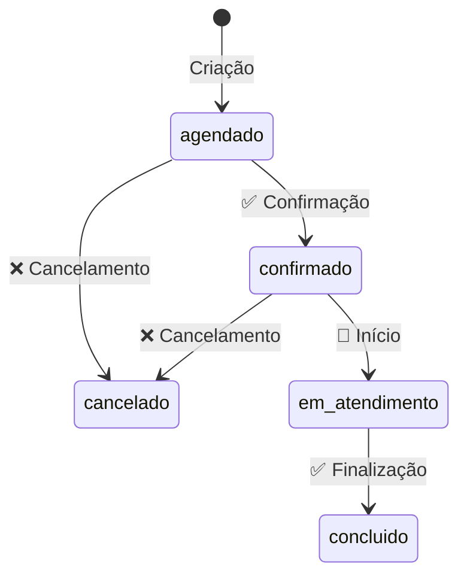

<div align="center">

# Prontuário Fácil

**Prontuário eletrônico LGPD compliant para clínicas médicas**

Gestão completa de pacientes, consultas, agendamentos, exames e prescrições.


</div>

---

## Sobre

O **Prontuário Fácil** é uma aplicação web Single Page Application construída em React/Vite que funciona como um prontuário eletrônico aderente à LGPD para clínicas médicas. Seu objetivo é prover a gestão completa e centralizada de pacientes, consultas, agendamentos e exames para médicos e administradores de clínicas.

> **Nota:** Esta aplicação foi desenvolvida na plataforma [Base44](https://base44.com) com auxílio de inteligência artificial. O README original do template mencionava Supabase, mas o backend é inteiramente gerenciado pelo Base44 (BaaS).

---

## Stack Tecnológica

| Camada | Tecnologia | Versão |
|--------|-----------|--------|
| **Frontend** | React | 18.2 |
| **Build** | Vite | 6.1 |
| **Estilo** | Tailwind CSS | 3.4 |
| **Componentes** | Radix UI (shadcn/ui) | — |
| **Estado** | Tanstack React Query | 5.84 |
| **Roteamento** | React Router DOM | 7.18 |
| **Forms** | React Hook Form + Zod | 7.54 / 3.24 |
| **Gráficos** | Recharts | 2.15 |
| **Animações** | Framer Motion | 11.16 |
| **Maps** | React Leaflet | 4.2 |
| **PDF** | jsPDF + html2canvas | 4.2 / 1.4 |
| **Backend** | Base44 SDK (BaaS) | 0.8.43 |

---

## Arquitetura

### Diagrama de Contexto



### Diagrama de Containers



> **Modo Offline:** Quando `VITE_OFFLINE=true`, a aplicação substitui o SDK Base44 por um mock client (`src/api/mockClient.js`) que persiste dados no `localStorage` do navegador. Mesma UI, mesma arquitetura, repositório de dados diferente.

---

## Funcionalidades

| Módulo | Descrição |
|--------|-----------|
| **Pacientes** | CRUD completo, status ativo/inativo, campos LGPD (consentimento, CPF criptografado) |
| **Agendamentos** | Calendário, seleção de horários, fluxo de status (agendado → confirmado → em atendimento → concluído) |
| **Consultas** | Anamnese, sinais vitais, diagnóstico CID-10, timeline de atendimento |
| **Templates** | Modelos de documentos (prescrições, atestados, laudos) com filtro por tipo |
| **Prescrições** | Editor de receitas com lista de medicamentos (nome, dosagem, frequência, duração) |
| **Exames** | Upload e gestão de laudos laboratoriais |
| **Dashboard** | Métricas: consultas de hoje, agendamentos, taxa de atendimento, gráficos |
| **Logs de Acesso** | Auditoria LGPD — todo acesso sensível é registrado |
| **Modo Offline** | Mock local ativado por env var, para demonstração e desenvolvimento sem backend |

---

## Getting Started

### Pré-requisitos

- Node.js 18+
- npm ou yarn

### Instalação

```bash
# Clone o repositório
git clone https://github.com/seu-usuario/prontuario-facil.git
cd prontuario-facil

# Instale as dependências
npm install
```

### Variáveis de Ambiente

Crie um arquivo `.env.local` na raiz do projeto:

```env
# Configuração Base44 (obrigatório para modo online)
VITE_BASE44_APP_ID=seu_app_id
VITE_BASE44_APP_BASE_URL=https://seu-app.base44.app

# Modo Offline (opcional — usa mock local em vez do backend)
VITE_OFFLINE=true
```

**Parâmetros via query string** (alternativa ao `.env.local`):
- `app_id` — ID do aplicativo
- `access_token` — Token de acesso
- `app_base_url` — URL base do backend

### Scripts Disponíveis

```bash
npm run dev        # Inicia o servidor de desenvolvimento
npm run build      # Gera o build de produção
npm run preview    # Visualiza o build localmente
npm run lint       # Verifica problemas de código
npm run lint:fix   # Corrige problemas automaticamente
npm run typecheck  # Valida tipos com TypeScript
```

### Acessando o App

Após executar `npm run dev`, acesse:

```
http://localhost:5173
```

---

## Estrutura do Projeto

```
prontuario-facil/
├── base44/                    # Configuração da plataforma Base44
│   ├── config.jsonc           # Nome do app, comandos de build
│   └── entities/              # Schemas das entidades (BaaS)
│       ├── Patient.jsonc
│       ├── Doctor.jsonc
│       ├── Appointment.jsonc
│       ├── Consultation.jsonc
│       ├── Exam.jsonc
│       ├── Prescription.jsonc
│       ├── Template.jsonc
│       └── AccessLog.jsonc
├── src/
│   ├── api/
│   │   ├── base44Client.js    # Cliente SDK Base44
│   │   ├── mockClient.js      # Mock local (modo offline)
│   │   └── mockSeed.js        # Dados de demonstração
│   ├── components/
│   │   ├── appointments/      # Calendário, seleção de horários
│   │   ├── medical/           # Componentes clínicos
│   │   └── ui/                # shadcn/ui (~60 componentes)
│   ├── lib/
│   │   ├── AuthContext.jsx    # Contexto de autenticação
│   │   └── utils.js          # Utilitários (cn())
│   ├── pages/                 # Telas da aplicação
│   ├── App.jsx                # Raiz com providers e rotas
│   ├── Layout.jsx             # Layout com navegação
│   └── pages.config.js       # Mapa central de páginas/rotas
├── _reversa_sdd/              # Documentação completa (Reversa v1.3.2)
│   ├── c4-context.md          # C4 Nível 1 — Contexto
│   ├── c4-containers.md       # C4 Nível 2 — Containers
│   ├── c4-components.md       # C4 Nível 3 — Componentes
│   ├── erd-complete.md        # ERD completo (9 entidades)
│   └── traceability/          # Rastreabilidade specs↔código
├── docs/
│   └── security-audit/        # Auditoria de segurança
│       ├── relatorio-auditoria-seguranca.md
│       └── relatorio-auditoria-seguranca.pdf
├── .agents/skills/            # Skills do framework Reversa
├── .github/skills/            # Skills de auditoria e convenções
├── package.json
├── tailwind.config.js
└── vite.config.js
```

---

## Modelo de Dados



---

## Regras de Negócio

### Gestão de Pacientes
- Apenas pacientes com status `ativo` podem ser selecionados para novos agendamentos ou consultas
- CPF armazenado de forma criptografada
- Campos LGPD: `lgpd_consent`, `lgpd_consent_date`, `lgpd_consent_ip`

### Fluxo de Agendamentos



### Controle de Acesso (RBAC)

| Entidade | Create | Read | Update | Delete |
|----------|--------|------|--------|--------|
| Patient | Autenticados | `created_by_id` ou admin | `created_by_id` ou admin | `created_by_id` ou admin |
| Appointment | Autenticados | `created_by_id` ou admin | `created_by_id` ou admin | `created_by_id` ou admin |
| Consultation | Autenticados | `created_by_id` ou admin | `created_by_id` ou admin | `created_by_id` ou admin |
| Doctor | Admin | Público | Admin | Admin |
| Template | Admin | Profissionais de saúde | Admin | Admin |
| AccessLog | Sistema | Admin | Admin | Admin |

---

## Documentação Completa

Este projeto possui documentação detalhada gerada pelo framework **Reversa** (v1.3.2) de engenharia reversa, disponível em `_reversa_sdd/`:

### Arquitetura (C4)

| Artefato | Descrição |
|----------|-----------|
| `c4-context.md` | Diagrama de contexto (Nível 1) — sistema, personas e integrações |
| `c4-containers.md` | Diagrama de containers (Nível 2) — SPA, repositório de dados, variante offline |
| `c4-components.md` | Diagrama de componentes (Nível 3) — decomposição interna da SPA |

### Modelo de Dados

| Artefato | Descrição |
|----------|-----------|
| `erd-complete.md` | ERD completo com 9 entidades, atributos e cardinalidades |
| `data-dictionary.md` | Dicionário de dados por entidade |
| `database/` | Diagramas ERD, relacionamentos e regras de negócio |

### Análise e Rastreabilidade

| Artefato | Descrição |
|----------|-----------|
| `inventory.md` | Inventário completo do projeto |
| `soul.md` | Síntese executiva e decisões fundadoras |
| `domain.md` | Regras de negócio e glossário |
| `code-analysis.md` | Análise módulo a módulo |
| `code-spec-matrix.md` | Mapeamento código↔especificação |
| `traceability/spec-impact-matrix.md` | Matriz de impacto entre módulos |
| `permissions.md` | Matriz de permissões RBAC |
| `state-machines.md` | Máquinas de estado |
| `confidence-report.md` | Relatório de confiança da documentação |

### Módulos Documentados

Cada módulo possui specs completas em `_reversa_sdd/[modulo]/`:

- `requirements.md` — Requisitos funcionais
- `design.md` — Decisões de design técnico
- `tasks.md` — Plano de implementação
- `screens.md` — Especificação de telas

---

## Segurança

O projeto passou por auditoria de segurança automatizada (04/09/2026). Relatório completo em `docs/security-audit/`.

### Resumo dos Achados

| Severidade | Qtde | Descrição |
|------------|------|-----------|
| 🟠 **Alta** | 3 | Rotas admin sem RBAC, token em URL, IDOR |
| 🟡 **Média** | 1 | Queries sem filtro de tenant |
| 🔵 **Baixa** | 1 | `dangerouslySetInnerHTML` em componente |

### Achados Principais

| ID | Severidade | Categoria | Descrição |
|----|------------|-----------|-----------|
| F-01 | 🟠 Alta | Permissão no navegador | Rotas admin (AccessLogs, Doctors, Templates) expostas a todos os usuários autenticados sem verificação de role |
| F-02 | 🟠 Alta | Chaves expostas | Token de acesso passado via query string da URL sem remoção |
| F-03 | 🟠 Alta | IDOR | Acesso direto a recursos (Patient, Consultation) via parâmetro `id` na URL sem validação de posse |
| F-04 | 🟡 Média | Isolamento de dados | Queries amplas em Patient, Consultation, Prescription sem filtro de organização/tenant |
| F-05 | 🔵 Baixa | XSS | Uso de `dangerouslySetInnerHTML` em `src/components/ui/chart.jsx` |

### Pontos Fortes

- ✅ Autenticação e sessão centralizadas via `base44.auth.me()`
- ✅ Auditoria LGPD com registro de eventos de acesso (`AccessLog`)
- ✅ Comunicação segura via SDK oficial `@base44/sdk`
- ✅ Modo offline encapsulado para desenvolvimento/testes

> **Relatório completo:** `docs/security-audit/relatorio-auditoria-seguranca.md`
> **Dados estruturados:** `docs/security-audit/achados.json`

---

## Contribuindo

1. Fork o repositório
2. Crie uma branch para sua feature (`git checkout -b feature/nova-feature`)
3. Commit suas alterações (`git commit -m 'Adiciona nova feature'`)
4. Push para a branch (`git push origin feature/nova-feature`)
5. Abra um Pull Request

### Convenções

- **Commits:** Siga as convenções do projeto (ver `.github/skills/`)
- **Código:** Utilize componentes shadcn/ui sempre que possível
- **Estilo:** Prefira classes Tailwind utilitárias over CSS customizado
- **Testes:** Adicione testes quando aplicável (framework ainda não configurado)

### Antes de Submeter

- Execute `npm run lint` e `npm run typecheck`
- Verifique se não há regressões de segurança (ver seção **Segurança**)
- Para auditoria completa, use a skill `security-code-audit` (`.github/skills/security-code-audit/`)

---

## Notas Conhecidas

| Item | Status | Descrição |
|------|--------|-----------|
| **CI/CD** | ❌ Não configurado | Nenhum pipeline de integração contínua (sem `.github/workflows/`) |
| **Testes automatizados** | ❌ Não configurado | Nenhum framework de teste instalado (`test_file_count: 0`) |
| **RBAC frontend** | ⚠️ Parcial | Rotas admin expostas sem verificação de role (ver F-01) |
| **Dependências não usadas** | ⚠️ Presentes | Stripe, react-leaflet incluídas no `package.json` mas não utilizadas no `src/` |

---

## License

MIT

---

<div align="center">
  <p><b>Contagem de visitantes</b></p>
  
  <br>
  
</div>
