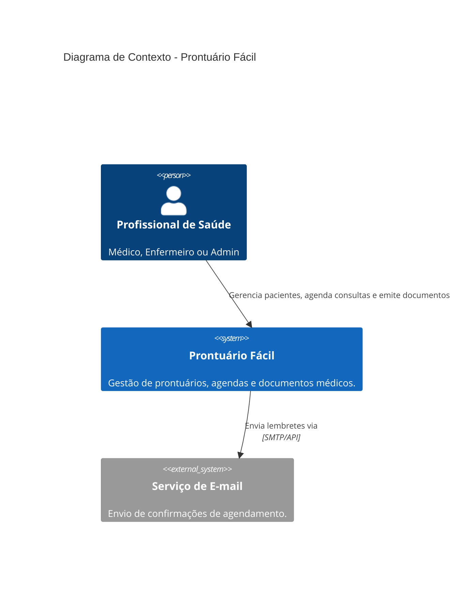
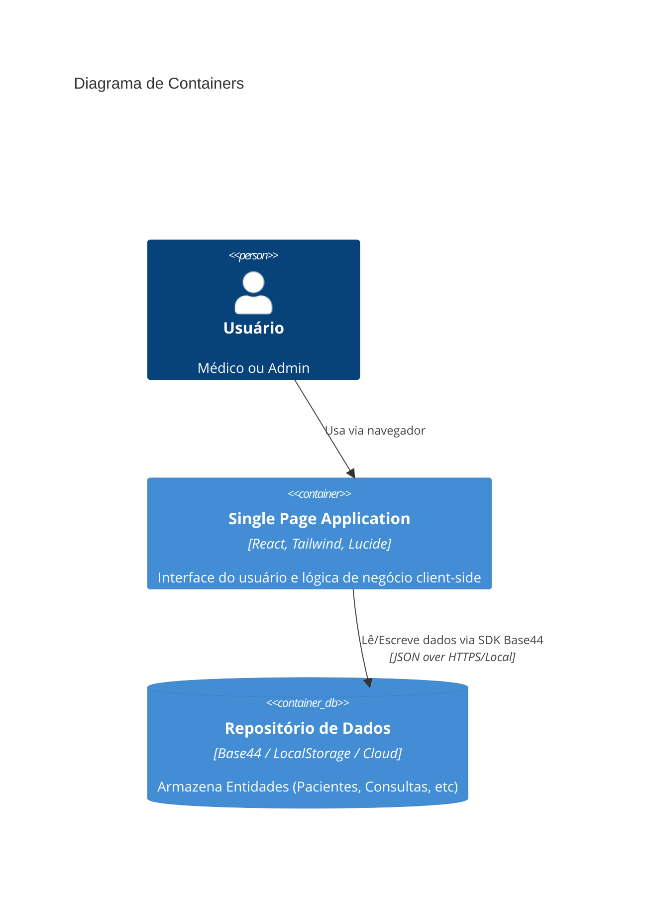

# Arquitetura do Sistema — prontuario-facil

## 1. Diagrama de Contexto (C4 Level 1)

O sistema simplifica a gestão de uma clínica médica, permitindo que Médicos e Admins gerenciem o ciclo de vida do paciente.

## 2. Diagrama de Containers (C4 Level 2)

> **Variante de deployment (adicionada em 2026-08-28):** quando `VITE_OFFLINE=true`, o container `spa` substitui o uso do SDK Base44 por um mock client (`src/api/mockClient.js`) que persiste no `localStorage` do navegador. Mesmo container, mesma UI, repositório de dados diferente. Não há mudanças nos contratos consumidos pelas pages.

## 3. Fluxo de Dados Principal

1. **Agendamento**: Médico seleciona Paciente (Ativo) e Médico → Cria `Appointment`.
2. **Atendimento**: No horário, Médico muda `Appointment` para `em_atendimento` → Cria `Consultation`.
3. **Documentação**: Durante a `Consultation`, Médico usa `Templates` → Cria `Prescription` / `Exam`.
4. **Finalização**: Médico marca `Consultation` como `concluida` → `Appointment` atualizado para `concluido`.
