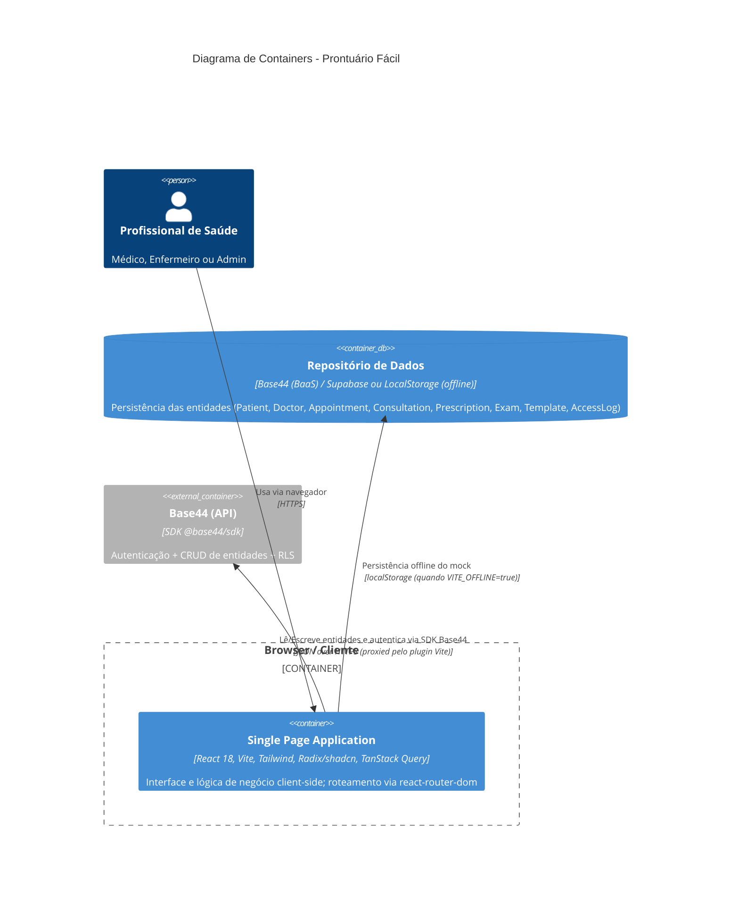

# C4 — Diagrama de Containers (Nível 2) — prontuario-facil

> Artefato canônico do `reversa-architect`. Visão de **containers** (Nível 2 do C4): aplicações, serviços, banco de dados e a comunicação entre eles.
> `doc_level: completo` | Escala: 🟢 CONFIRMADO | 🟡 INFERIDO | 🔴 LACUNA

## Visão de Containers



## Containers

| Container | Tecnologia | Responsabilidade | Confiança |
| :--- | :--- | :--- | :---: |
| **SPA (Prontuário Fácil)** | React 18 + Vite | Interface, lógica de negócio client-side, roteamento | 🟢 |
| **Repositório de Dados** | Base44 (BaaS) / Supabase | Persistência das entidades e RLS | 🟢 |
| **Base44 (API)** | `@base44/sdk` (proxied pelo plugin Vite) | Auth + CRUD de entidades | 🟢 |
| **localStorage (offline)** | Navegador | Persistência do mock client quando `VITE_OFFLINE=true` | 🟢 |

## Variante de Deployment — Modo Offline 🟢

Quando `VITE_OFFLINE=true`, o container `spa` **substitui** o uso da API Base44 pelo mock client (`src/api/mockClient.js` + `mockSeed.js`), persistindo no `localStorage` do navegador:

```mermaid
C4Container
    title Variante Offline (VITE_OFFLINE=true)
    Person(user, "Profissional de Saúde", "Médico/Admin/Dev")

    Container(spa, "Single Page Application", "React 18, Vite", "Mesma UI; chama base44.entities.* normalmente")
    Container(mock, "Mock Client", "mockClient.js + mockSeed.js", "Proxy de entities + auth bypass em localStorage")

    Rel(user, spa, "Usa via navegador")
    Rel(spa, mock, "Lê/Escreve via interface idêntica ao SDK")
    Rel(mock, "localStorage", "Persiste coleções mock_db_<Entity>")
```

- Mesmo container, mesma UI; apenas o **repositório de dados** muda (Base44 → `localStorage`).
- Não há mudança nos contratos consumidos pelas pages. (Fonte: `architecture.md`, `modo-offline/design.md`.)

---
*Gerado pelo Reversa-Architect (alinhamento canônico) em 2026-08-31.*
