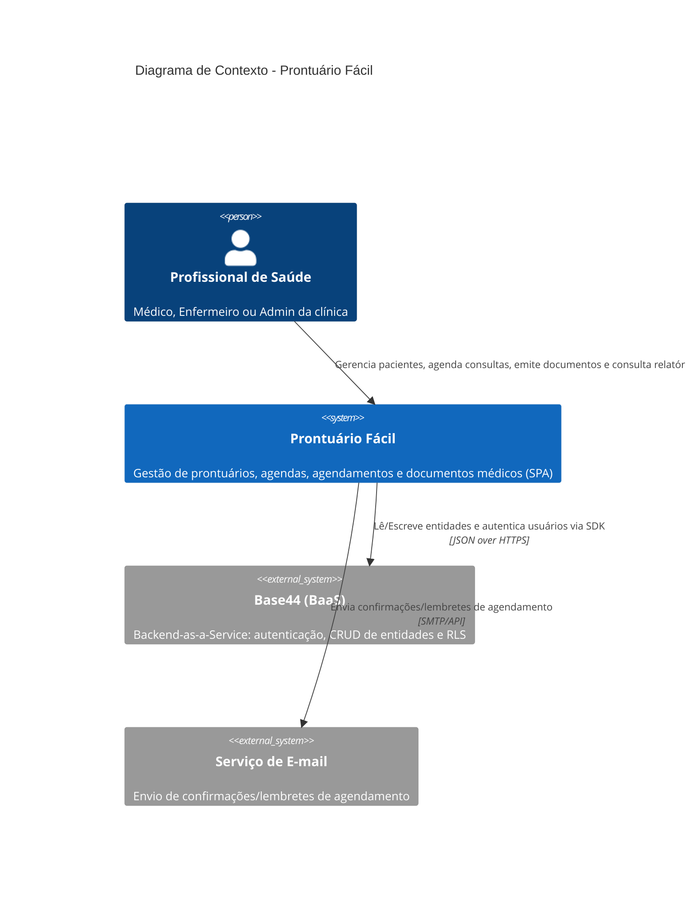

# C4 — Diagrama de Contexto (Nível 1) — prontuario-facil

> Artefato canônico do `reversa-architect`. Visão de **contexto** (Nível 1 do C4): o sistema no centro, as personas que o usam e os sistemas externos com que se integra.
> `doc_level: completo` | Escala: 🟢 CONFIRMADO | 🟡 INFERIDO | 🔴 LACUNA

## Visão de Contexto

O **Prontuário Fácil** é uma SPA (React/Vite) de prontuário eletrônico aderente à LGPD para clínicas médicas. Gerencia o ciclo de vida do paciente: cadastro com consentimento LGPD, agendamentos, consultas/anamnese, emissão de documentos clínicos (receitas, atestados, exames) e auditoria de acesso a dados sensíveis.

## Elementos do Contexto

| Elemento | Tipo | Descrição | Confiança |
| :--- | :--- | :--- | :---: |
| **Prontuário Fácil** | Sistema | SPA de prontuário eletrônico em React/Vite | 🟢 |
| **Profissional de Saúde** | Persona | Médico/Enfermeiro/Admin que opera o sistema | 🟢 |
| **Base44** | Sistema externo | BaaS de backend: auth + CRUD + RLS (`@base44/sdk`) | 🟢 |
| **Serviço de E-mail** | Sistema externo | Envio de confirmações de agendamento | 🟡 (chamada externa inferida) |

## Integrações Externas Detectadas

| Integração | Tipo | Uso real | Confiança |
| :--- | :--- | :--- | :---: |
| **Base44** | Backend-as-a-Service | Sim — principal (auth + CRUD de entidades via `@base44/sdk`) | 🟢 |
| **Serviço de E-mail** | Envio de e-mail | Confirmações/lembretes de agendamento | 🟡 |
| Stripe / react-leaflet / jsPDF | (resíduos de template) | Não usados no `src/` | 🟢 |

> Fonte: `architecture.md`, `dependencies.md` (Scout), `.reversa/context/surface.json`.

---
*Gerado pelo Reversa-Architect (alinhamento canônico) em 2026-08-31.*
