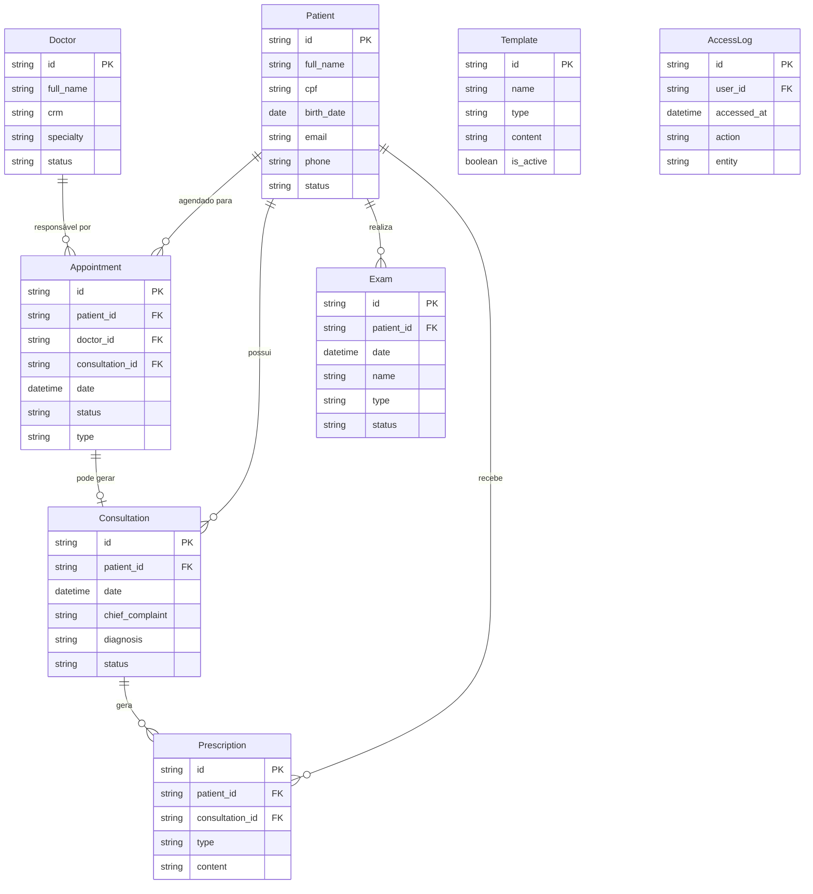

# Diagrama de Entidade e Relacionamento (ERD)

> Gerado por reversa-data-master em 27/08/2026.
> Baseado nos schemas JSON do diretório `base44/entities/`.

## ERD Completo

```mermaid
erDiagram
    Patient {
        string id PK
        string full_name
        string cpf
        date birth_date
        string email
        string phone
        string status
    }
    
    Doctor {
        string id PK
        string full_name
        string crm
        string specialty
        string status
    }
    
    Appointment {
        string id PK
        string patient_id FK
        string doctor_id FK
        string consultation_id FK
        datetime date
        string status
        string type
    }
    
    Consultation {
        string id PK
        string patient_id FK
        datetime date
        string chief_complaint
        string diagnosis
        string status
    }
    
    Exam {
        string id PK
        string patient_id FK
        datetime date
        string name
        string type
        string status
    }
    
    Prescription {
        string id PK
        string patient_id FK
        string consultation_id FK
        string type
        string content
    }
    
    Template {
        string id PK
        string name
        string type
        string content
        boolean is_active
    }
    
    AccessLog {
        string id PK
        string user_id FK
        datetime accessed_at
        string action
        string entity
    }

    %% Relacionamentos
    Patient ||--o{ Appointment : "agendado para"
    Doctor ||--o{ Appointment : "responsável por"
    Appointment ||--o| Consultation : "pode gerar"
    Patient ||--o{ Consultation : "possui"
    Consultation ||--o{ Prescription : "gera"
    Patient ||--o{ Exam : "realiza"
    Patient ||--o{ Prescription : "recebe"
```
