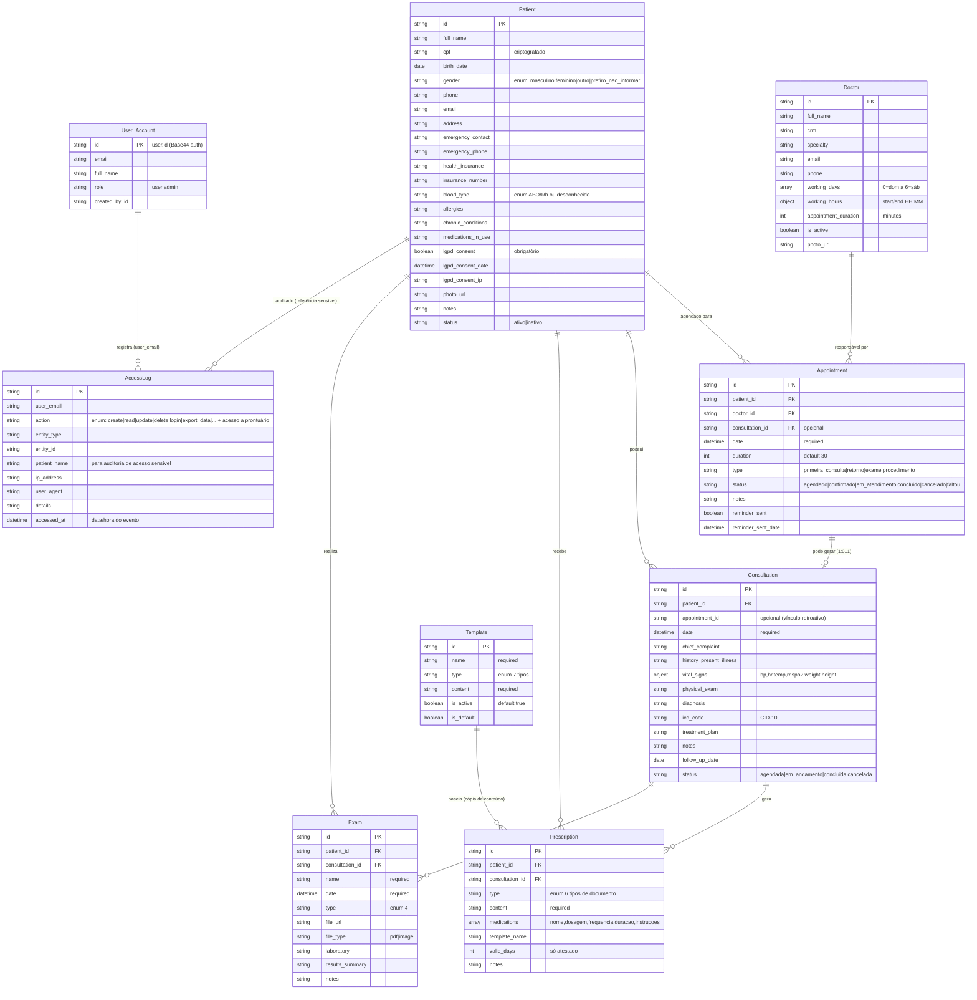

# ERD Completo — prontuario-facil

> Artefato canônico do `reversa-architect`. Modelo de dados completo (todas as entidades com atributos, chaves, cardinalidades e relacionamentos), consolidado a partir de `database/erd.md`, `database/relationships.md`, `data-dictionary.md` e dos schemas `base44/entities/*.jsonc`.
> `doc_level: completo` | Escala: 🟢 CONFIRMADO | 🟡 INFERIDO | 🔴 LACUNA

## ERD — Diagrama Completo

## Entidades e Atributos

| Entidade | Descrição | Atributos principais | Chave | Confiança |
| :--- | :--- | :--- | :---: | :---: |
| **Patient** | Paciente da clínica com consentimento LGPD | `full_name`, `cpf`, `birth_date`, `lgpd_consent`, `lgpd_consent_date`, `lgpd_consent_ip`, `status` | `id` | 🟢 |
| **Doctor** | Profissional de saúde e jornada de trabalho | `full_name`, `crm`, `specialty`, `working_days`, `working_hours`, `appointment_duration`, `is_active` | `id` | 🟢 |
| **Appointment** | Reserva de horário entre paciente e médico | `patient_id`, `doctor_id`, `date`, `duration`, `type`, `status`, `reminder_sent` | `id` | 🟢 |
| **Consultation** | Registro clínico do atendimento | `patient_id`, `date`, `chief_complaint`, `vital_signs`, `diagnosis`, `icd_code`, `status` | `id` | 🟢 |
| **Prescription** | Documento emitido (receita/atestado/exame) | `patient_id`, `consultation_id`, `type`, `content`, `medications`, `valid_days` | `id` | 🟢 |
| **Exam** | Exame solicitado/resultado | `patient_id`, `consultation_id`, `name`, `date`, `type`, `file_url` | `id` | 🟢 |
| **Template** | Modelo de documento clínico | `name`, `type`, `content`, `is_active`, `is_default` | `id` | 🟢 |
| **AccessLog** | Trilha de auditoria (append-only) | `user_email`, `action`, `entity_type`, `entity_id`, `patient_name`, `ip_address`, `user_agent`, `accessed_at` | `id` | 🟢 |
| **User_Account** | Conta do operador (Base44 auth) | `email`, `full_name`, `role`, `created_by_id` | `id` | 🟡 |

## Relacionamentos

| Relação | Cardinalidade | Chave(s) | Semântica | Confiança |
| :--- | :---: | :--- | :--- | :---: |
| Patient → Appointment | 1 : N | `Appointment.patient_id` | Um paciente tem vários agendamentos | 🟢 |
| Doctor → Appointment | 1 : N | `Appointment.doctor_id` | Um médico atende vários agendamentos | 🟢 |
| Appointment → Consultation | 1 : 0..1 | `Appointment.consultation_id` | Agendamento concluído pode gerar consulta (link retroativo) | 🟢 |
| Patient → Consultation | 1 : N | `Consultation.patient_id` | Histórico clínico do paciente | 🟢 |
| Consultation → Prescription | 1 : N | `Prescription.consultation_id` | Consulta emite vários documentos | 🟢 |
| Consultation → Exam | 1 : N | `Exam.consultation_id` | Consulta solicita exames | 🟢 |
| Patient → Prescription | 1 : N | `Prescription.patient_id` | Paciente recebe prescrições | 🟢 |
| Patient → Exam | 1 : N | `Exam.patient_id` | Paciente possui exames | 🟢 |
| Template → Prescription | 1 : N (fraco) | cópia de `content` | Template é copiado; alterar não afeta prescrições emitidas | 🟢 |
| Patient → AccessLog | referência | `patient_name` / `entity_id` | Auditoria de acesso a dados sensíveis | 🟢 |
| User_Account → AccessLog | 1 : N | `AccessLog.user_email` | Operador que executou a ação | 🟡 |

## Notas e Observações

- **Exclusão de paciente** requer tratamento de registros órfãos (Appointment/Consultation/Prescription/Exam) — relacionamento forte. 🟢
- **Appointment ↔ Consultation** é 1:1 opcional: nem todo agendamento gera consulta (cancelados/faltas), e o vínculo é gravado retroativamente. 🟢
- **AccessLog** é *append-only*: leitura apenas por `admin`; escrita apenas pelo sistema. 🟢
- **User_Account** deriva da auth Base44; `id`/`role`/`created_by_id` **não** existem no `OFFLINE_USER` do modo offline. 🟡

> Fonte: `database/erd.md`, `database/relationships.md`, `database/data-dictionary.md`, `code-analysis.md` (§5 de cada módulo) e schemas `base44/entities/*.jsonc`.

---
*Gerado pelo Reversa-Architect (alinhamento canônico) em 2026-08-31.*
