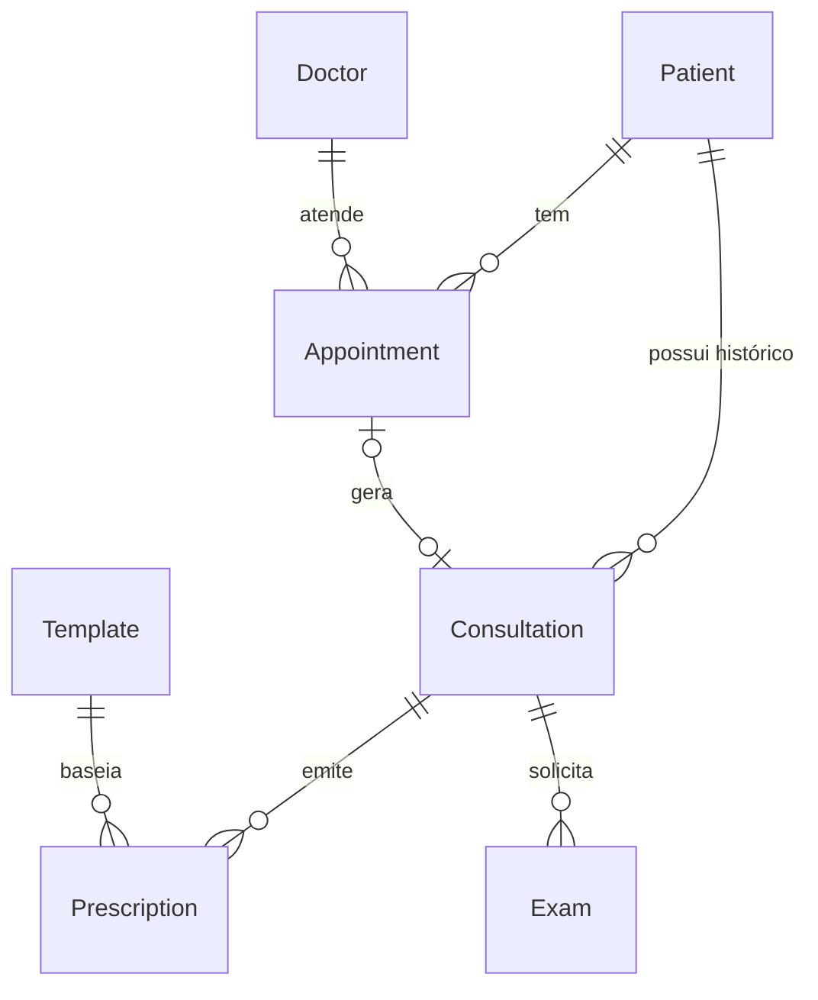

# Modelo de Dados (ERD) — prontuario-facil

> ⚠️ **Alias/espelho.** O ERD completo canônico está em **`erd-complete.md`** (com todas as entidades, atributos e cardinalidades). Este arquivo é mantido na raiz como atalho de referência e não deve divergir do canônico.

## Diagrama Resumido

## Relacionamentos Críticos 🟢

1. **Patient -> Appointment/Consultation**: Relacionamento forte. Exclusão de paciente requer tratamento de registros órfãos.
2. **Appointment <-> Consultation**: Link 1:1 opcional. Nem todo agendamento gera consulta (ex: cancelados), mas toda consulta deveria estar ligada a um agendamento.
3. **Template -> Prescription**: Relacionamento fraco (apenas cópia de conteúdo). Mudar um template não afeta prescrições já emitidas.

> Para o modelo completo com todos os atributos, ver `erd-complete.md`.

---
*Gerado pelo Reversa-Architect em 2026-08-31. Conteúdo completo consolidado em `erd-complete.md`.*
