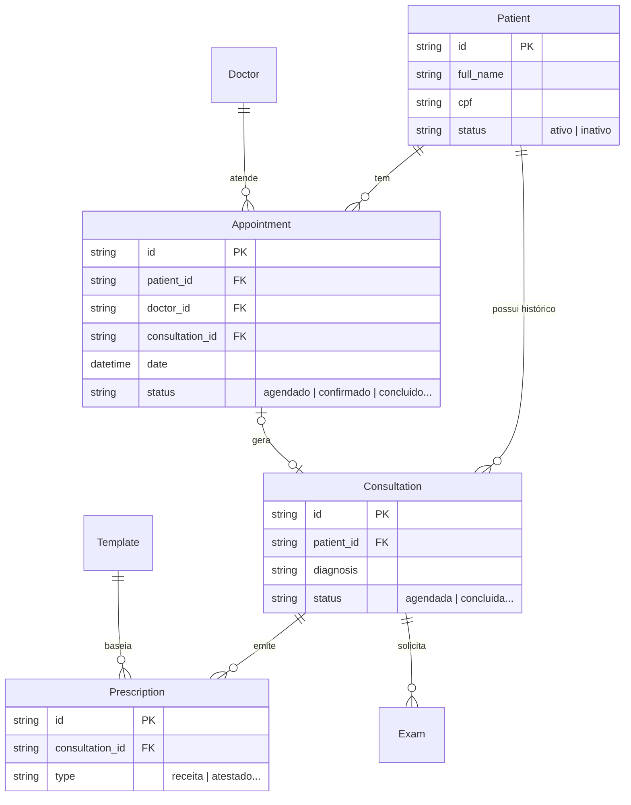

# Modelo de Dados (ERD) — prontuario-facil

Este diagrama representa as entidades e seus relacionamentos conforme definido nos arquivos `.jsonc` e na lógica de componentes.

## Relacionamentos Críticos 🟢

1. **Patient -> Appointment/Consultation**: Relacionamento forte. Exclusão de paciente requer tratamento de registros órfãos.
2. **Appointment <-> Consultation**: Link 1:1 opcional. Nem todo agendamento gera consulta (ex: cancelados), mas toda consulta deveria estar ligada a um agendamento.
3. **Template -> Prescription**: Relacionamento fraco (apenas cópia de conteúdo). Mudar um template não afeta prescrições já emitidas.

---
*Gerado pelo Reversa-Architect em 2026-08-31.*
