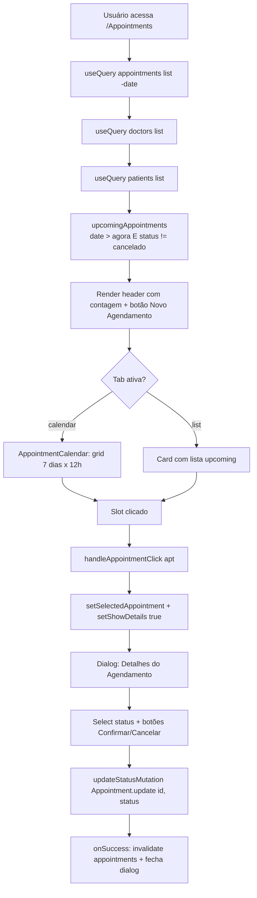
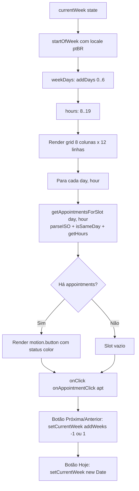
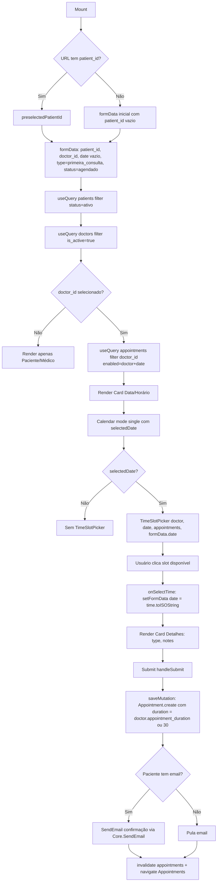
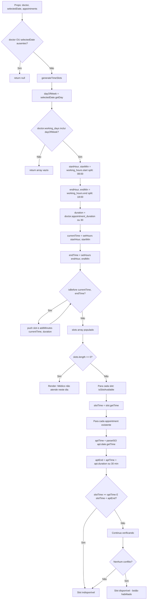
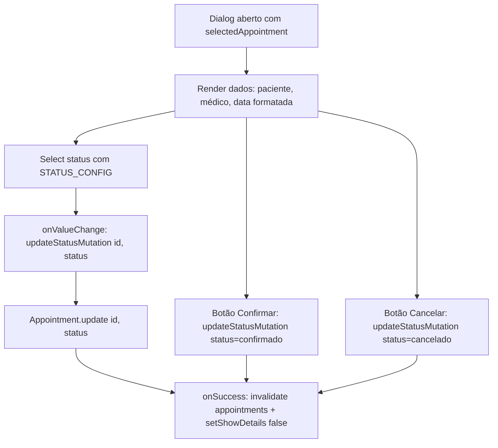
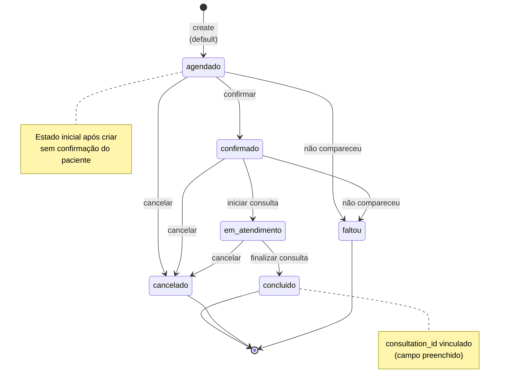

# Fluxogramas — Módulo `agendamentos`

> Gerado pelo Archaeologist em 2026-08-25 | Nível: **completo** | Mermaid.js
>
> Fonte: `src/pages/Appointments.jsx`, `src/pages/NewAppointment.jsx`,
> `src/components/appointments/AppointmentCalendar.jsx`,
> `src/components/appointments/TimeSlotPicker.jsx`, `base44/entities/Appointment.jsonc`

---

## 1. Fluxo Principal: Listagem com Vistas (Calendário + Lista)

---

## 2. Fluxo: Calendário Semanal (`AppointmentCalendar.jsx`)

---

## 3. Fluxo: Criação de Agendamento (`NewAppointment.jsx`)

---

## 4. Fluxo: TimeSlotPicker — Geração e Verificação de Disponibilidade

---

## 5. Fluxo: Atualização de Status no Dialog

---

## 6. Máquina de Estados: Status do Agendamento

**Transições permitidas (mapeadas a partir do código):**
- `agendado` → `confirmado` (botão "Confirmar")
- `agendado` → `cancelado` (botão "Cancelar")
- Qualquer estado → qualquer outro via `Select` (a UI não restringe)

---

## 7. Legenda

| Símbolo | Significado |
|---------|-------------|
| `flowchart TD` | Top-Down |
| `A[Texto]` | Processo/Estado |
| `A --> B` | Transição |
| `A -->|Cond| B` | Transição condicional |
| `{Cond?}` | Decisão |
| `|Sim|` / `|Não|` | Ramificações |
| `stateDiagram-v2` | Máquina de estados |
