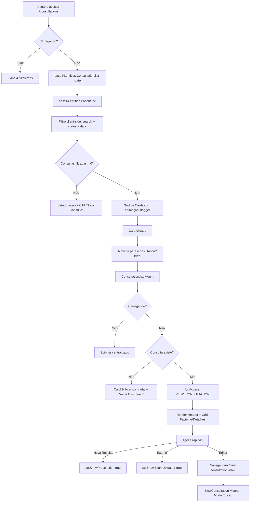
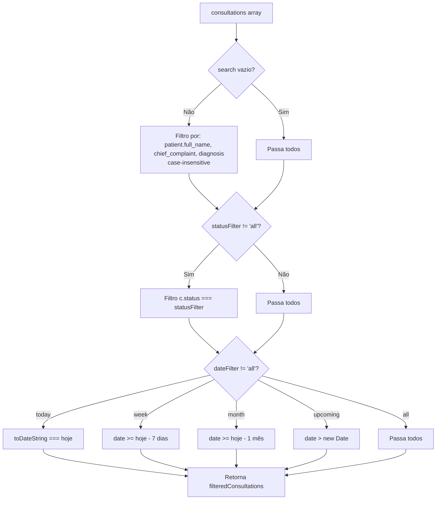
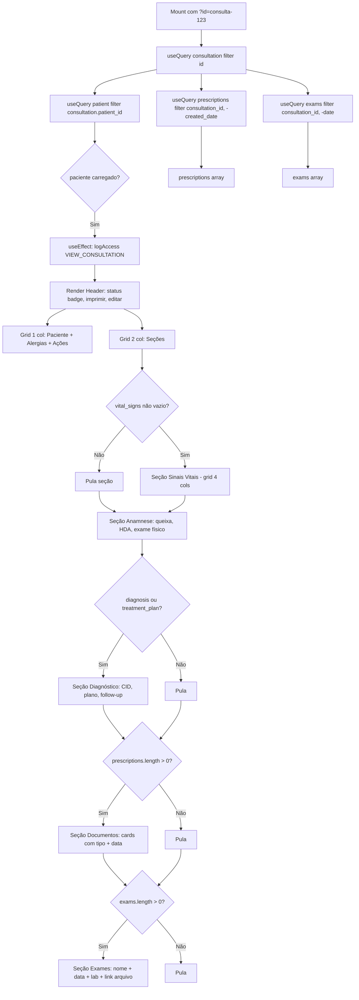

# Fluxogramas — Módulo `consultas`

> Gerado pelo Archaeologist em 2026-08-22 | Nível: **completo** | Mermaid.js

---

## 1. Fluxo Principal: Listagem → Detalhe → Edição/Novos Documentos



---

## 2. Fluxo: Listagem com Filtros Combinados



---

## 3. Fluxo: Detalhe da Consulta (Consultation.jsx)



---

## 4. Fluxo: Criação/Edição de Consulta (NewConsultation.jsx)

```mermaid
flowchart TD
    A[Mount] --> B{Lê URL: ?id= ou ?patient_id=?}
    B -->|id| C[Modo Edição: useQuery consultation]
    B -->|patient_id| D[Pré-seleção paciente: setSelectedPatient]
    B -->|nenhum| E[Modo Novo: formData defaults]
    C --> F[useEffect: popula formData + setSelectedPatient]
    E --> G[useQuery patients filter status=ativo, -full_name]
    D --> G
    G --> H[Busca paciente: nome/CPF → top 5]
    H --> I[Usuário seleciona paciente]
    I --> J[setSelectedPatient + formData.patient_id]
    J --> K[Formulário em etapas animadas]
    K --> L[1. Data/hora* + Status + Retorno]
    K --> M[2. Sinais Vitais (VitalSignsForm)]
    K --> N[3. Anamnese: queixa, HDA, exame físico]
    K --> O[4. Diagnóstico: CID-10, plano, observações]
    O --> P[Submit - exige selectedPatient]
    P --> Q{consultationId?}
    Q -->|Sim| R[Mutation: Consultation.update + logAccess EDIT_CONSULTATION]
    Q -->|Não| S[Mutation: Consultation.create + logAccess CREATE_CONSULTATION]
    R --> T{Sucesso?}
    S --> T
    T -->|Sim| U[invalidateQueries consultations]
    U --> V[navigate PatientDetail do paciente]
    T -->|Não| W[Toast Erro]
```

---

## 5. Fluxo: Editor de Prescrição/Documentos (PrescriptionEditor)

```mermaid
flowchart TD
    A[PatientDetail: Botão 'Nova Receita'/'Atestado'] --> B[setShowPrescription true]
    B --> C[Dialog Abre]
    C --> D{initialData?}
    D -->|Sim| E[Preenche type, content, medications, validDays, notes]
    D -->|Não| F[resetForm defaults]
    E --> G[Usuário seleciona Tipo Documento]
    F --> G
    G --> H{Tipo == 'atestado'?}
    H -->|Sim| I[Exibe 'Dias de Afastamento']
    H -->|Não| J[Oculta]
    G --> K[Carrega Templates: filter type + is_active=true]
    K --> L[Usuário seleciona Template]
    L --> M[applyTemplate: substitui {PACIENTE_NOME}, {PACIENTE_CPF}, {DATA}, {DATA_EXTENSO}]
    M --> N[Usuário edita Conteúdo]
    N --> O{Tipo inclui 'receita'?}
    O -->|Sim| P[Seção Medicamentos: add/update/remove]
    O -->|Não| Q[Pula]
    P --> R[Medicamento: nome, dosagem, frequência, duração, instruções]
    R --> S[Clica Salvar]
    Q --> S
    S --> T[handleSave: monta payload]
    T --> U{type inclui 'receita'?}
    U -->|Sim| V[medications array]
    U -->|Não| W[medications: []]
    V --> X[validDays só se 'atestado']
    W --> X
    X --> Y[onSave data + onOpenChange false]
    Y --> Z[Parent: invalidateQueries prescriptions]
```

---

## 6. Fluxo: Upload de Exame (ExamUploader)

```mermaid
flowchart TD
    A[PatientDetail: Botão 'Exame'] --> B[setShowExamUploader true]
    B --> C[Dialog Abre]
    C --> D[Usuário clica Drop Zone]
    D --> E{Arquivo selecionado?}
    E -->|Sim| F[handleFileChange: setFile + preview se image]
    E -->|Não| G[Permanece inicial]
    F --> H[Preenche: nome*, tipo, data, laboratório, resumo, obs]
    H --> I[Clica 'Salvar Exame']
    I --> J{file + name?}
    J -->|Não| K[Botão desabilitado]
    J -->|Sim| L[setIsUploading true]
    L --> M[base44.integrations.Core.UploadFile {file}]
    M --> N{Upload OK?}
    N -->|Não| O[console.error + isUploading false]
    N -->|Sim| P[file_url + file_type]
    P --> Q[Monta examData: patient_id, consultation_id, file_url...]
    Q --> R[onSave examData]
    R --> S[logAccess UPLOAD_EXAM]
    S --> T[resetForm + onOpenChange false]
    T --> U[Dialog Fecha]
    U --> V[Parent: invalidateQueries exams]
```

---

## 7. Fluxo: Gerenciamento de Medicações (PrescriptionEditor)

```mermaid
flowchart TD
    A[Tipo inclui 'receita'] --> B[Seção Medicamentos visível]
    B --> C[Botão 'Adicionar']
    C --> D[addMedication: push {name,dosage,frequency,duration,instructions}]
    D --> E[Lista de Cards - cada medicamento]
    E --> F{updateMedication index, field, value}
    E --> G{removeMedication index}
    F --> H[Imutável: spread + campo atualizado]
    G --> I[filter index !== alvo]
    H --> J[Re-render lista]
    I --> J
    J --> K[handleSave: medications incluído no payload]
```

---

## 8. Fluxo: Auditoria de Acesso (AccessLogger)

```mermaid
flowchart TD
    A[Ação monitorada] --> B[logAccess action, entityType?, entityId?, patientName?, details?]
    B --> C[base44.auth.me()]
    C --> D{Usuário autenticado?}
    D -->|Não| E[console.error - silencioso]
    D -->|Sim| F[Payload AccessLog]
    F --> G[base44.entities.AccessLog.create]
    G --> H{Sucesso?}
    H -->|Sim| I[Log gravado]
    H -->|Não| J[console.error 'Error logging access']
    I --> K[Base44 RLS: user vê próprios logs / admin vê todos]
```

---

## Legenda

| Símbolo | Significado |
|---------|-------------|
| `flowchart TD` | Top-Down |
| `A[Texto]` | Processo/Estado |
| `A --> B` | Transição |
| `A -->|Cond| B` | Transição condicional |
| `{Cond?}` | Decisão |
| `|Sim|` / `|Não|` | Ramificações |