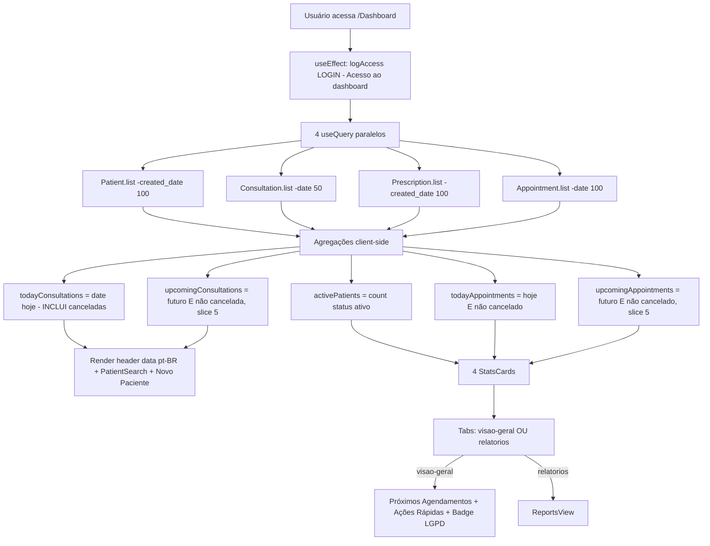
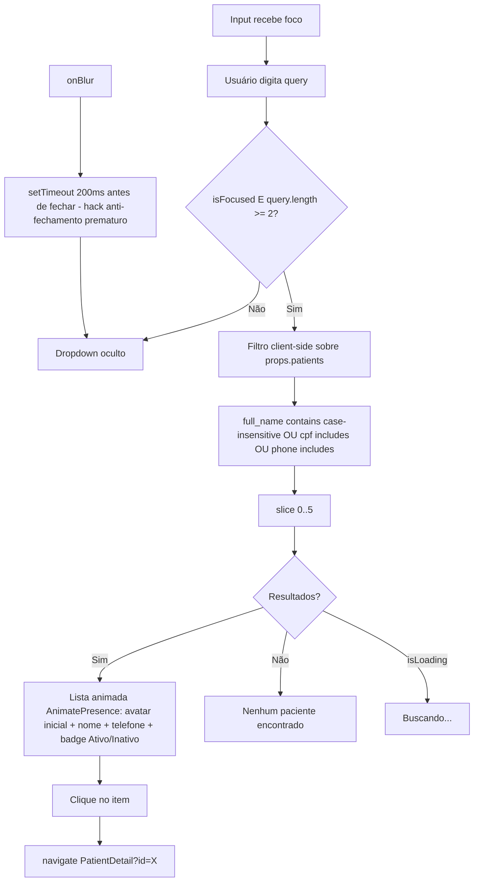
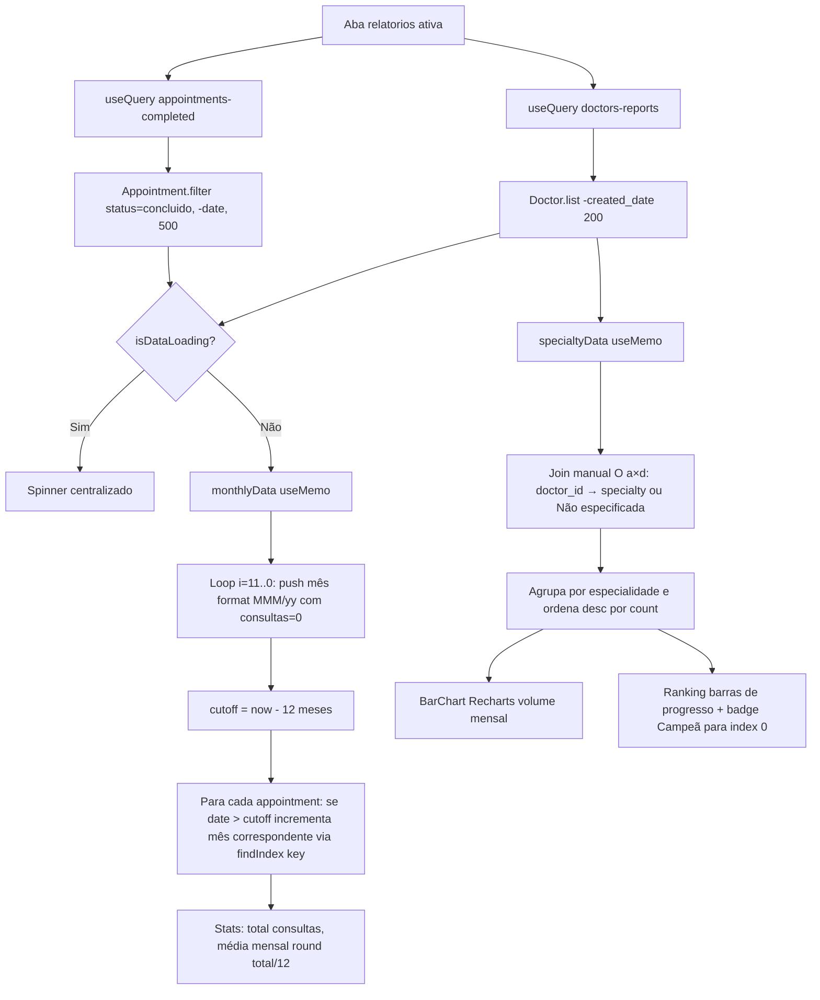
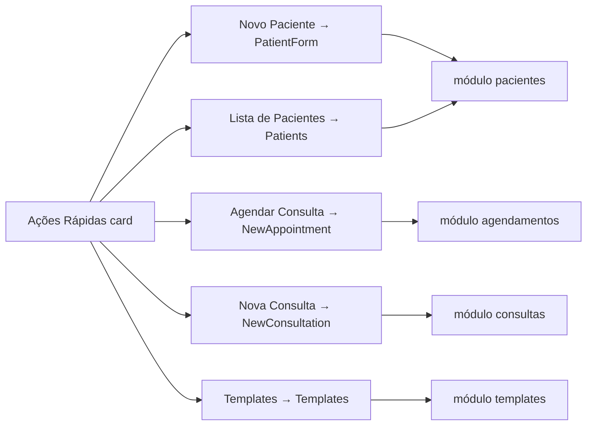
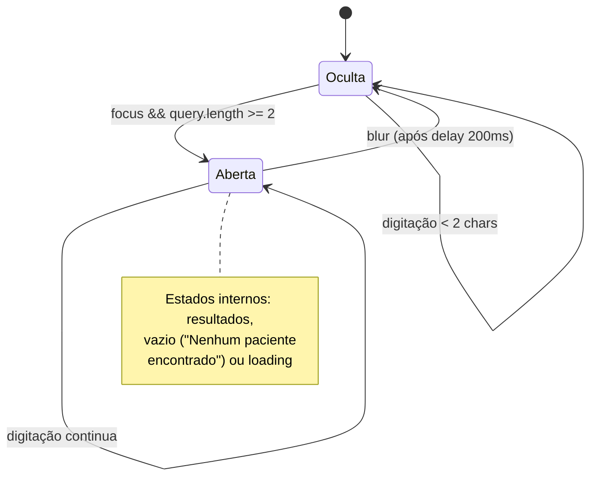

# Fluxogramas — Módulo `dashboard`

> Gerado pelo Archaeologist em 2026-08-26 | Nível: **completo** | Mermaid.js
>
> Fonte: `src/pages/Dashboard.jsx`, `src/components/medical/StatsCard.jsx`, `src/components/medical/PatientSearch.jsx`, `src/components/medical/ReportsView.jsx`

---

## 1. Fluxo Principal: Carregamento do Dashboard

---

## 2. Fluxo: Busca de Paciente (PatientSearch)

---

## 3. Fluxo: Relatórios (ReportsView)

---

## 4. Fluxo: Ações Rápidas (navegação)

---

## 5. Máquina de Estados da Busca (PatientSearch)

---

## Lacunas Identificadas

1. **Taxa de Atendimento hardcoded**: `value="94%"` decorativo, sem cálculo real.
2. **"Documentos Emitidos" truncado**: conta apenas as últimas 100 prescrições retornadas.
3. **Inconsistência de canceladas**: `todayConsultations` inclui canceladas; `todayAppointments` exclui.
4. **LOGIN log a cada mount**: visita ao dashboard ≠ login real; infla auditoria.
5. **Join O(a×d)** em ReportsView: escala mal com volume; usar Map.
6. **Cache keys colidem**: Dashboard usa `['patients']` com limite 100; Patients.jsx mesma chave sem limite — ordem de mount define o cache.
7. **Sem teste** para nenhuma agregação.
