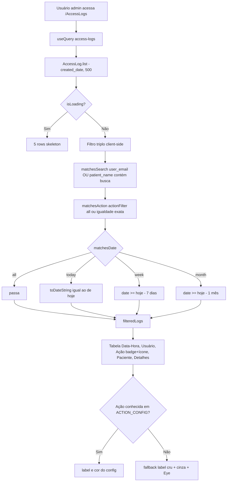
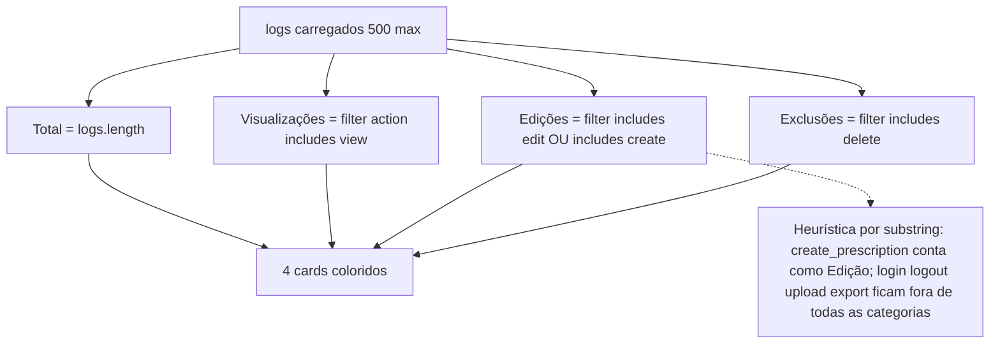
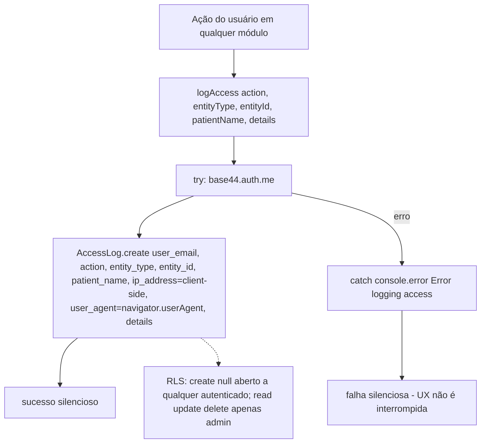
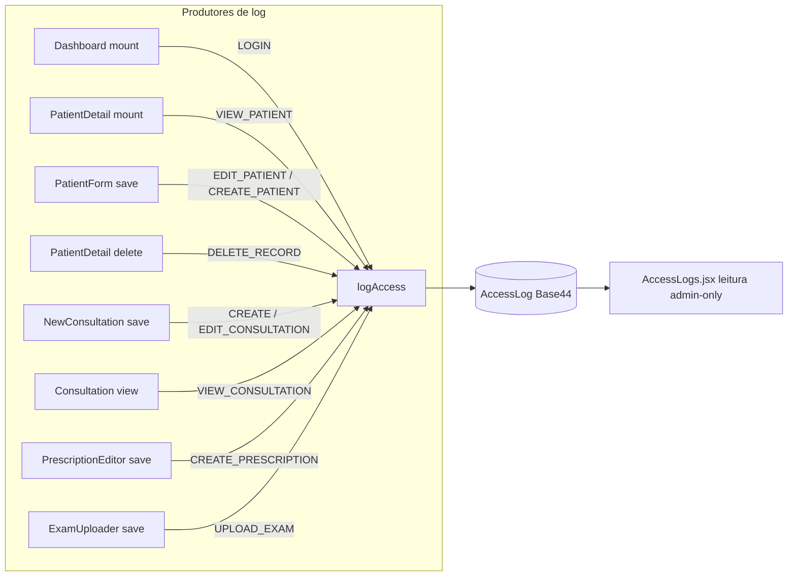

# Fluxogramas — Módulo `logs-acesso`

> Gerado pelo Archaeologist em 2026-08-26 | Nível: **completo** | Mermaid.js
>
> Fonte: `src/pages/AccessLogs.jsx`, `src/components/medical/AccessLogger.jsx`, `base44/entities/AccessLog.jsonc`

---

## 1. Fluxo Principal: Visualização de Logs de Auditoria

---

## 2. Fluxo: Painel de Estatísticas

---

## 3. Fluxo do Produtor: logAccess (transversal)

---

## 4. Fluxo das Chamadas Registradas (quem produz logs)

---

## Lacunas Identificadas

1. **Teto rígido de 500 registros**: sem paginação — histórico antigo inacessível.
2. **Stats por substring**: `create_prescription` somado como "Edição"; login/logout/upload/export fora de todas as categorias.
3. **`export_data` nunca logado**: ícone Download decorativo na UI; nenhuma exportação implementada.
4. **`details` com tipo inconsistente**: schema declara string; o logger envia object ou null.
5. **IP fake**: `ip_address` sempre `'client-side'` — sem valor forense real.
6. **LOGIN a cada visita ao dashboard**: `Dashboard.useEffect` dispara log de login a cada mount, não em autenticação real.
7. **Sem rotação/limpeza**: crescimento ilimitado da coleção (sem política de retenção visível).
