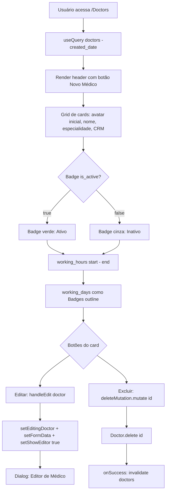
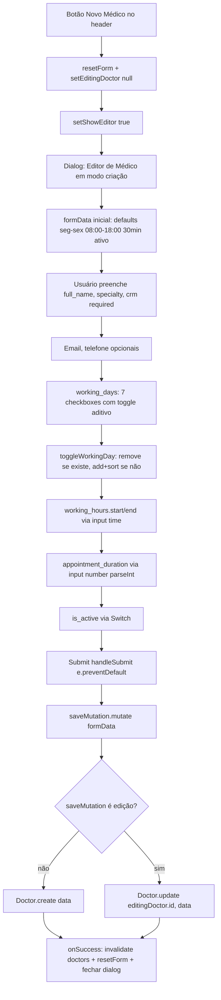
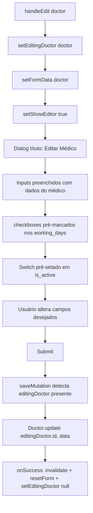
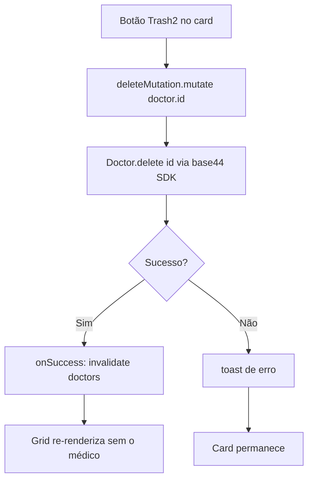
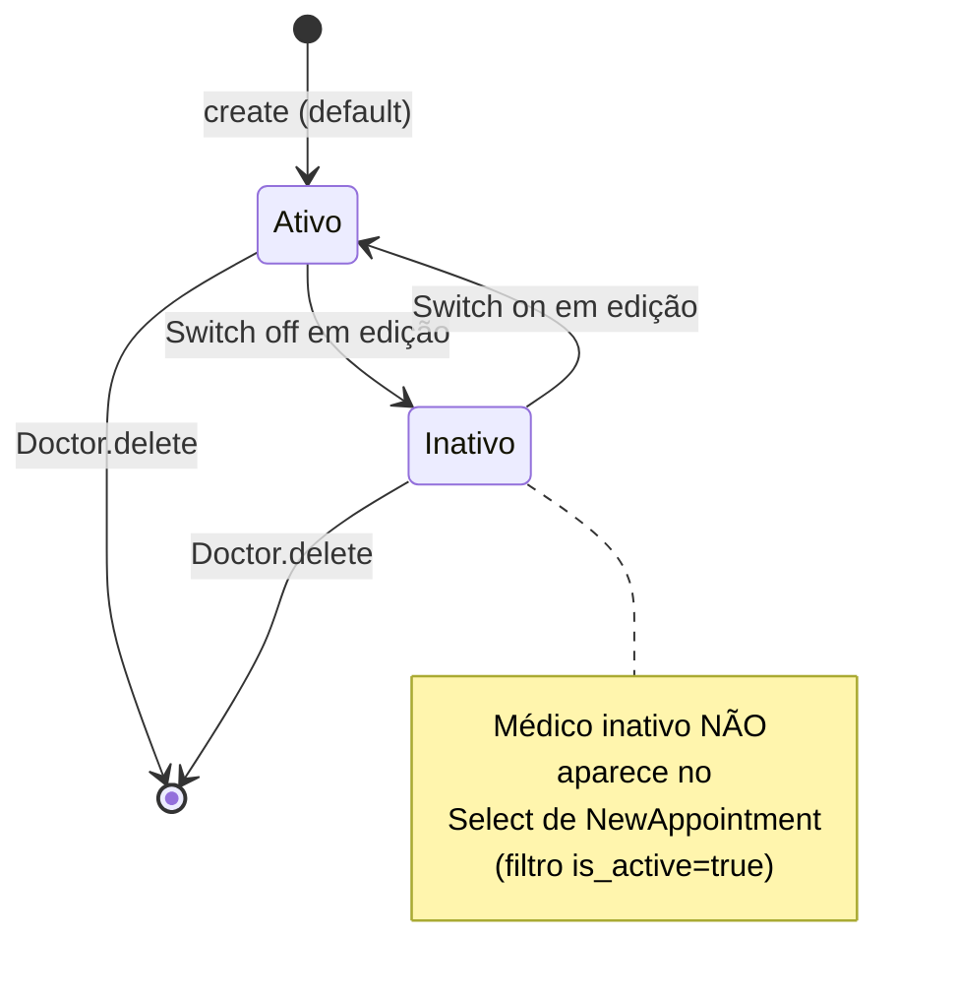
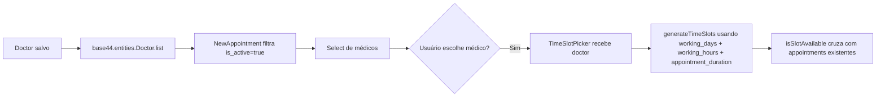

# Fluxogramas — Módulo `medicos`

> Gerado pelo Archaeologist em 2026-08-25 | Nível: **completo** | Mermaid.js
>
> Fonte: `src/pages/Doctors.jsx`, `base44/entities/Doctor.jsonc`

---

## 1. Fluxo Principal: Listagem de Médicos

---

## 2. Fluxo: Criação de Médico

---

## 3. Fluxo: Edição de Médico

---

## 4. Fluxo: Exclusão de Médico

---

## 5. Máquina de Estados do Toggle `is_active`

---

## 6. Integração com TimeSlotPicker (consumidor)

---

## Lacunas Identificadas

1. **Sem confirmação de exclusão**: o botão `Trash2` chama `deleteMutation.mutate` direto — sem `AlertDialog` de confirmação. Risco de exclusão acidental.
2. **Sem upload de foto**: campo `photo_url` existe no schema mas não há controle de upload em `Doctors.jsx`. Avatar do card é gerado pela inicial do nome.
3. **Sem validação de CRM**: campo livre (sem regex de CRM/UF).
4. **Sem validação start < end**: `working_hours.start` e `end` são inputs independentes; nada impede `start > end`.
5. **Sem auditoria**: nenhuma chamada a `logAccess` ao criar/editar/excluir médicos.
6. **RLS apenas no backend**: como `create` exige admin, usuário comum recebe erro do Base44 (não tratado com mensagem amigável na UI).
