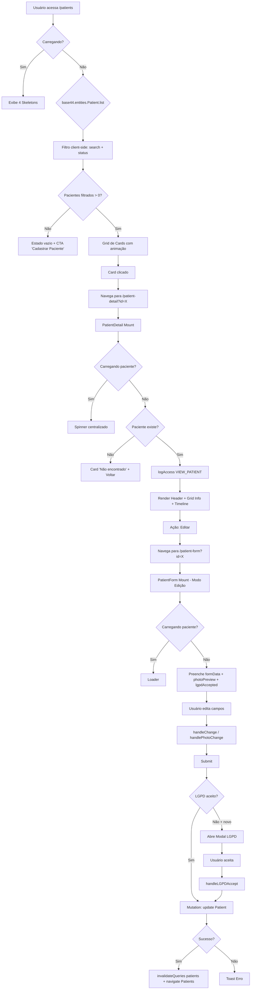
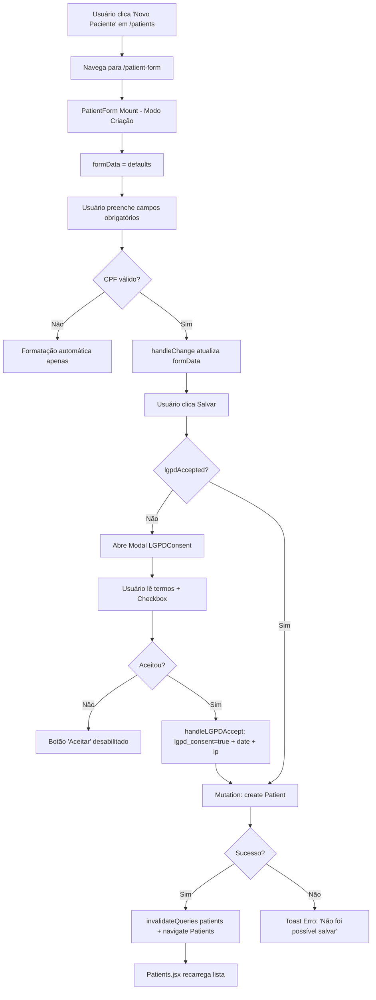
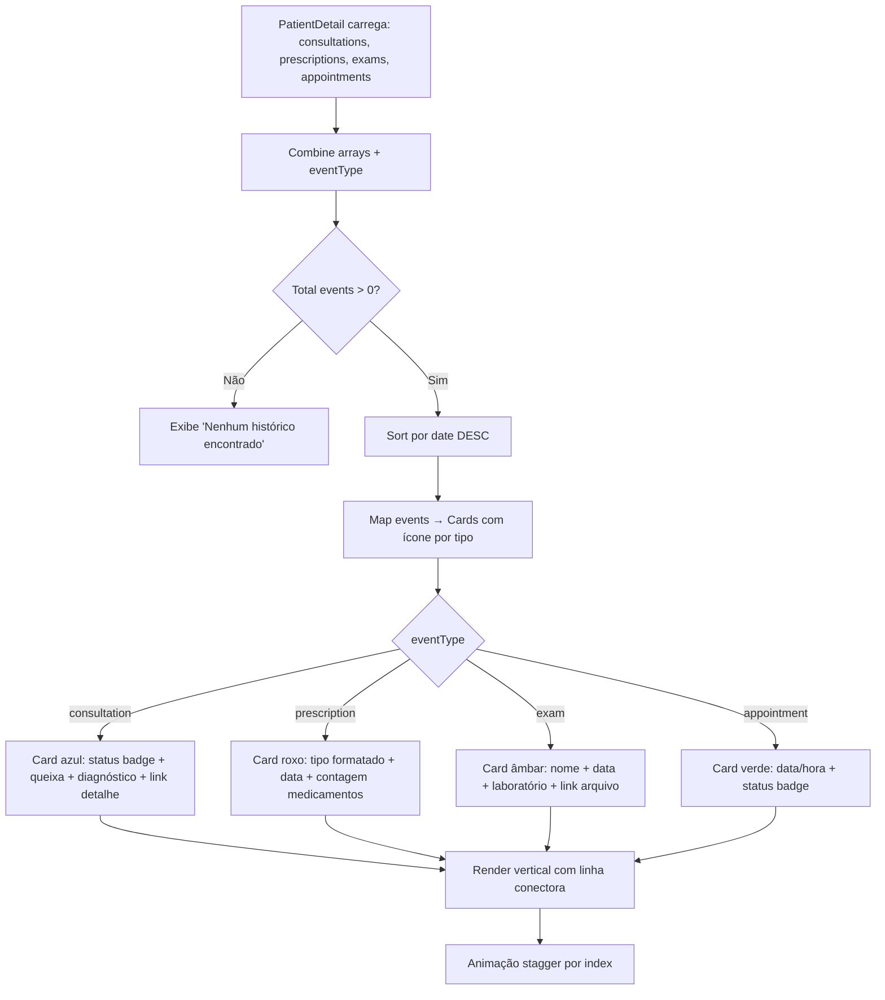
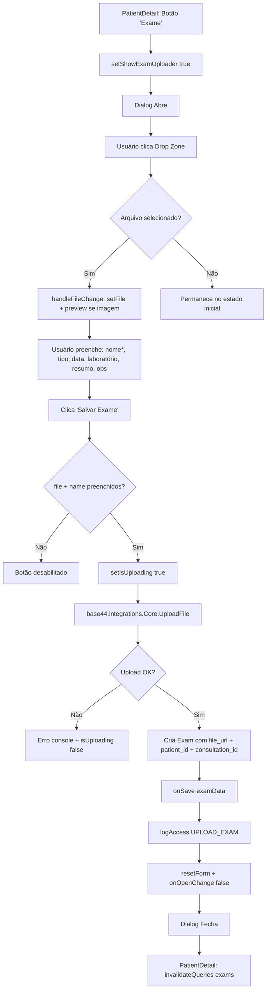
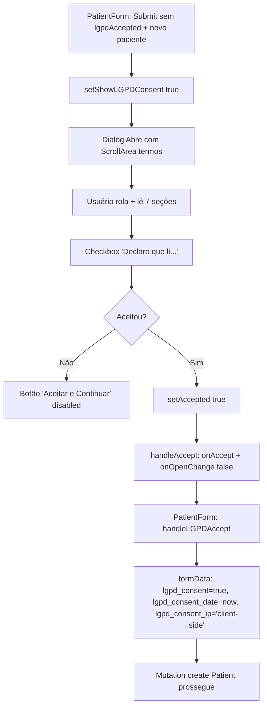

# Fluxogramas — Módulo `pacientes`

> Gerado pelo Archaeologist em 2026-08-22 | Nível: **completo** | Mermaid.js

---

## 1. Fluxo Principal: Listagem → Detalhe → Edição



---

## 2. Fluxo: Criação de Novo Paciente



---

## 3. Fluxo: Timeline Unificada (ConsultationTimeline)



---

## 4. Fluxo: Upload de Exame (ExamUploader)



---

## 5. Fluxo: Editor de Prescrição (PrescriptionEditor)

```mermaid
flowchart TD
    A[PatientDetail: Botão 'Receita'] --> B[setShowPrescription true]
    B --> C[Dialog Abre]
    C --> D{initialData?}
    D -->|Sim| E[Preenche type, content, medications, validDays, notes]
    D -->|Não| F[resetForm: defaults]
    E --> G[Usuário seleciona Tipo Documento]
    G --> H{Tipo == 'atestado'?}
    H -->|Sim| I[Exibe campo 'Dias de Afastamento']
    H -->|Não| J[Oculta campo]
    G --> K[Carrega Templates ativos por tipo]
    K --> L[Usuário seleciona Template]
    L --> M[applyTemplate: substitui {PACIENTE_NOME}, {PACIENTE_CPF}, {DATA}, {DATA_EXTENSO}]
    M --> N[Usuário edita Conteúdo]
    N --> O{Tipo inclui 'receita'?}
    O -->|Sim| P[Seção Medicamentos: add/update/remove]
    O -->|Não| Q[Pula medicamentos]
    P --> R[Usuário preenche: nome, dosagem, frequência, duração, instruções]
    R --> S[Clica Salvar]
    Q --> S
    S --> T[handleSave: monta data + onSave + onOpenChange false]
    T --> U[PatientDetail: invalidateQueries prescriptions]
```

---

## 6. Fluxo: Auditoria de Acesso (AccessLogger)

```mermaid
flowchart TD
    A[Qualquer ação monitorada] --> B[logAccess action, entityType, entityId, patientName, details]
    B --> C[base44.auth.me()]
    C --> D{Usuário autenticado?}
    D -->|Não| E[Erro silencioso: console.error]
    D -->|Sim| F[Monta payload AccessLog]
    F --> G[base44.entities.AccessLog.create]
    G --> H{Sucesso?}
    H -->|Sim| I[Log gravado]
    H -->|Não| J[console.error 'Error logging access']
    I --> K[Base44 RLS: user vê próprios logs ou admin vê todos]
```

---

## 7. Fluxo: Consentimento LGPD (LGPDConsent)



---

## Legenda

| Símbolo | Significado |
|---------|-------------|
| `flowchart TD` | Top-Down |
| `A[Texto]` | Processo/Estado |
| `A --> B` | Transição |
| `A -->|Cond| B` | Transição condicional |
| `{Cond?}` | Decisão |
| `|Sim|` / `|Não|` | Ramificações |