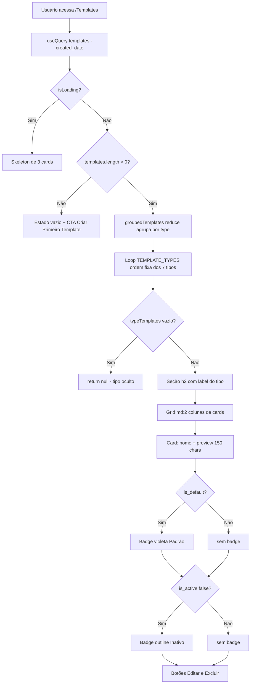
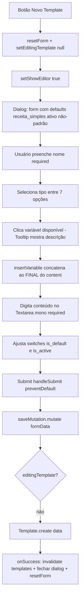
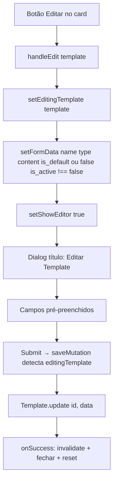
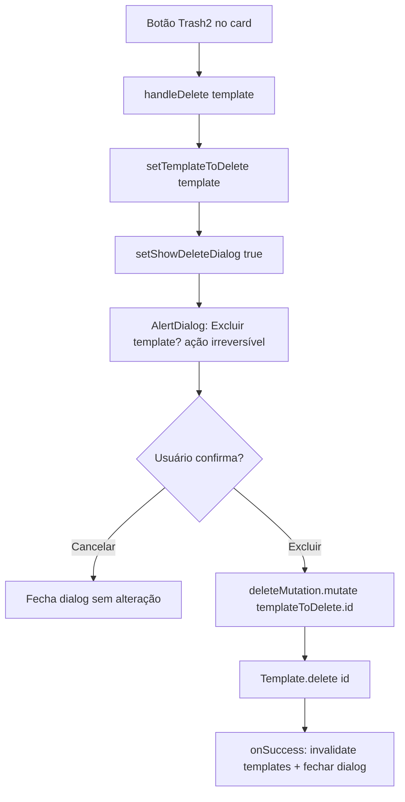
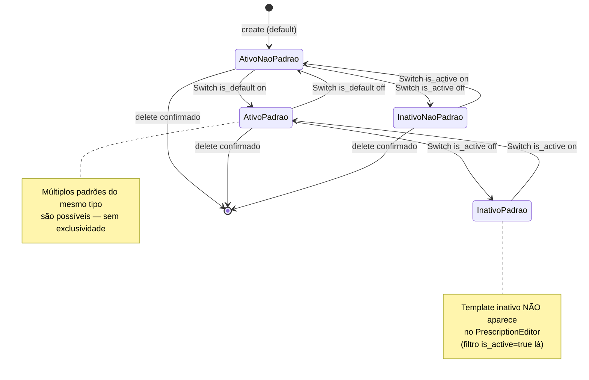

# Fluxogramas — Módulo `templates`

> Gerado pelo Archaeologist em 2026-08-26 | Nível: **completo** | Mermaid.js
>
> Fonte: `src/pages/Templates.jsx`, `base44/entities/Template.jsonc`

---

## 1. Fluxo Principal: Listagem Agrupada por Tipo

---

## 2. Fluxo: Criação de Template

---

## 3. Fluxo: Edição de Template

---

## 4. Fluxo: Exclusão com Confirmação

---

## 5. Máquina de Estados do Template

---

## Lacunas Identificadas

1. **`insertVariable` ignora cursor**: variável sempre concatenada ao final do Textarea.
2. **`variables` órfão**: campo existe no schema, nunca populado pela UI.
3. **`{DIAS_AFASTAMENTO}` sem substituidor**: anunciada na UI, mas o PrescriptionEditor só substitui as outras 4 variáveis.
4. **Múltiplos padrões possíveis**: nada impede dois templates `is_default` do mesmo tipo.
5. **Preview enganoso**: `substring(0,150)` + `"..."` aplicado mesmo a conteúdos curtos.
6. **RLS create admin-only sem feedback**: usuário comum recebe erro cru do Base44 ao tentar criar.
