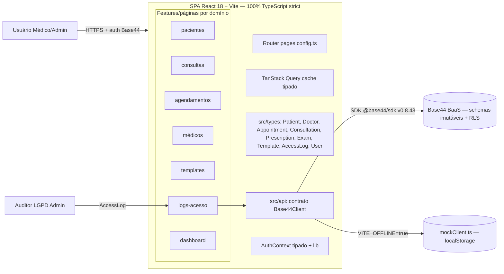

# Target Architecture

> Arquitetura alvo do sistema novo, respeitando o paradigma escolhido em `paradigm_decision.md` e a estratégia confirmada em `migration_strategy.md`.

## Visão geral

O sistema alvo é a **mesma SPA React 18 + Vite + Base44** do legado, agora **100% em TypeScript strict** com domínio tipado em `src/types/` e um **contrato `Base44Client`** que unifica SDK real e mock offline sob uma interface única. O paradigma permanece **funcional/declarativo** (componentes + hooks + TanStack Query) — a arquitetura não muda de forma; muda de **disciplina**: tipos obrigatórios em dados LGPD (CPF, `lgpd_consent*`), escopo `created_by_id`/`role` exigido por tipos (detecção de F-01/F-03 em compile-time) e acesso a dados por repositório tipado por domínio. Durante a migração (Estratégia A — incremental por camadas), o build convive com JS residual via `allowJs` e é cortado onda a onda até 100% TS.

## Diagrama (Mermaid)

## Componentes

| Componente | Tipo | Responsabilidade | Origem (legado / novo / fundido) |
|---|---|---|---|
| SPA shell (`App.tsx`, `Layout.tsx`, `pages.config.ts`) | UI shell | Providers (Auth, Query, Theme, Router) + rotas tipadas | preservado (`App.jsx`, `Layout.jsx`, `pages.config.js`) |
| Features/páginas por domínio (`src/pages/*.tsx`) | UI (pages) | 13 páginas dos 9 módulos, agora tipadas | preservado 1:1 (`src/pages/*.jsx`) |
| Componentes de UI (`src/components/<domínio>/*.tsx` + `ui/`) | UI (components) | Componentes clínicos e biblioteca shadcn/Radix | preservado (`src/components/*`) |
| `src/types/*.ts` | Domínio (tipos) | Interfaces das 9 entidades + tipos LGPD + unions de status | **novo** (exigido pelo brief) |
| `src/api/base44Client.ts` + `client.ts` + `mockClient.ts` + `mockSeed.ts` | API | Contrato `Base44Client` único; SDK real e mock implementam a interface | refatorado/fundido (`base44Client.js`, `mockClient.js`, `mockSeed.js`) |
| `src/lib/AuthContext.tsx` + `query-client.ts` + `utils.ts` + `app-params.ts` | Infra (lib) | Auth tipado, query client, utilitários | preservado (`src/lib/*`) |
| Base44 BaaS (externo) | Backend-as-a-Service | Auth, CRUD, RLS, schemas das 8 entidades | preservado (imutável — fora do escopo) |
| `localStorage` mock (offline) | Repositório de dados mock | Persistência do modo offline (`mock_db_*`) | preservado (comportamento BR-OFF) |

## Bounded contexts

> Opção 3 (híbrido) aprovada em `topology_decision.md`: bounded contexts são **agrupamentos lógicos** sobre a árvore atual — as pastas físicas de páginas/componentes não são reorganizadas; `src/types/` e `src/api/` são as únicas estruturas novas.

### BC-01: pacientes
- **Responsabilidade**: cadastro de pacientes, consentimento LGPD (`lgpd_consent*`), busca/seleção de pacientes ativos, timeline clínica.
- **Justificativa do agrupamento / separação**: mantém o módulo `pacientes` do legado; não foi decomposto 1-para-1 "só por ser pasta" — agrupa Patient + seus componentes clínicos (PatientSearch, LGPDConsent, ConsultationTimeline) que já vivem juntos no legado.
- **Componentes internos**: `Patients.tsx`, `PatientForm.tsx`, `PatientDetail.tsx`, `PatientSearch.tsx`, `LGPDConsent.tsx`, `types/Patient.ts`.
- **Eventos publicados**: N/A (paradigma funcional, sem mensageria).

### BC-02: consultas (+ prescrições e exames)
- **Responsabilidade**: ciclo do atendimento (anamnese, sinais vitais, CID-10), emissão de documentos (Prescription) e upload de exames (Exam).
- **Justificativa do agrupamento / separação**: Prescription/Exam **não** viraram bounded contexts próprios porque nascem **dentro** da consulta (BR-C03/BR-MIGRAR-008; fluxo `consultas/design.md` §2) e compartilham `patient_id`/`consultation_id` e o editor de templates — coesão de invariantes documentais com a consulta.
- **Componentes internos**: `Consultations.tsx`, `Consultation.tsx`, `NewConsultation.tsx`, `VitalSignsForm.tsx`, `PrescriptionEditor.tsx`, `ExamUploader.tsx`, `types/Consultation.ts|Prescription.ts|Exam.ts`.
- **Eventos publicados**: N/A.

### BC-03: agendamentos
- **Responsabilidade**: agenda semanal, criação de agendamentos validando jornada do médico, máquina de estados do Appointment.
- **Justificativa do agrupamento / separação**: módulo do legado com forte máquina de estados própria (BR-A03) e dependência da jornada de médicos (BR-A04/BR-MIGRAR-013) — mantido coeso; a validação de horário consome dados de médicos sem acoplar os contexts.
- **Componentes internos**: `Appointments.tsx`, `NewAppointment.tsx`, `AppointmentCalendar.tsx`, `TimeSlotPicker.tsx`, `types/Appointment.ts`.
- **Eventos publicados**: N/A.

### BC-04: medicos
- **Responsabilidade**: CRUD de médicos (admin), jornada de trabalho (`working_days`/`working_hours`/`appointment_duration`).
- **Justificativa do agrupamento / separação**: entidade de configuração com RLS própria (create/delete admin, read livre) — isolada porque é **dado mestre** consumido por agendamentos e consultas.
- **Componentes internos**: `Doctors.tsx`, `types/Doctor.ts`.
- **Eventos publicados**: N/A.

### BC-05: templates
- **Responsabilidade**: modelos de documentos (CRUD admin), variáveis de interpolação, filtro por tipo/ativo.
- **Justificativa do agrupamento / separação**: dado mestre de configuração com ciclo de vida próprio (admin-only) e contrato de placeholders consumido por consultas/pacientes — a separação evita que mudanças em templates vazem para a emissão de documentos (relação fraca: cópia de conteúdo — `erd.md`).
- **Componentes internos**: `Templates.tsx`, `types/Template.ts`, contrato de placeholders de interpolação.
- **Eventos publicados**: N/A.

### BC-06: logs-acesso
- **Responsabilidade**: auditoria LGPD append-only (leitura admin).
- **Justificativa do agrupamento / separação**: módulo transversal de auditoria, independente (append-only, sem downstream — `impact-matrix.md`) — isolado por natureza.
- **Componentes internos**: `AccessLogs.tsx`, `AccessLogger.tsx`, `types/AccessLog.ts`, enum `ACCESS_ACTIONS`.
- **Eventos publicados**: N/A.

### BC-07: dashboard
- **Responsabilidade**: KPIs, próximos agendamentos, busca global, relatórios.
- **Justificativa do agrupamento / separação**: hub de leitura que consome os demais contexts (Patient, Appointment, Consultation, Prescription) sem possuí-los — bounded context de **consulta/composição**, mantido separado para não acoplar leitura de KPIs à escrita dos domínios.
- **Componentes internos**: `Dashboard.tsx`, `StatsCard.tsx`, `ReportsView.tsx`, `PatientSearch.tsx` (uso), `types` (leitura).
- **Eventos publicados**: N/A.

### BC-08: modo offline (transversal)
- **Responsabilidade**: implementação mock do contrato `Base44Client` persistindo em `localStorage` quando `VITE_OFFLINE=true`.
- **Justificativa do agrupamento / separação**: não é um domínio — é uma **alternativa de runtime** (mesma classificação do legado: `modo-offline/requirements.md`); vira a segunda implementação do contrato tipado.
- **Componentes internos**: `mockClient.ts`, `mockSeed.ts`, `OFFLINE_USER` tipado.
- **Eventos publicados**: N/A.

## Decisões arquiteturais (ADR-style resumido)

### AD-01: Domínio tipado centralizado em `src/types/`
- **Decisão**: criar `src/types/` com uma interface por entidade (Patient, Doctor, Appointment, Consultation, Prescription, Exam, Template, AccessLog, User), espelhando fielmente os schemas `base44/entities/*.jsonc`, com unions de status/enums e marcação de campos sensíveis LGPD.
- **Alternativas descartadas**: tipos co-localizados por feature folder (exigiria topologia opção 2); tipos gerados automaticamente do SDK (SDK não expõe tipos fieis aos JSONC).
- **Justificativa**: brief exige o diretório; schemas BaaS são a fonte canônica imutável; tipos centralizados servem SDK real e mock (BR-MIGRAR-038) e permitem detectar campos LGPD/escopo em compile-time (paradigma functional + tipos).
- **Rastreabilidade**: `migration_brief.md` (Escopo incluído); `paradigm_decision.md` (gap nenhum, tipos como disciplina).

### AD-02: Contrato `Base44Client` (interface) implementado por SDK real e mock
- **Decisão**: definir interface `Base44Client` (entities CRUD + auth + integrações usadas) e fazer `sdkClient.ts` e `mockClient.ts` implementá-la; `base44Client.ts` seleciona por `VITE_OFFLINE`.
- **Alternativas descartadas**: manter mock avulso (desacoplamento silencioso — risco nº 5 do brief); tipar apenas o SDK real (offline quebraria).
- **Justificativa**: BR-MIGRAR-038; garante que modo offline compile contra o mesmo contrato e elimina degradação silenciosa (P3 do legado).
- **Rastreabilidade**: `target_business_rules.md` BR-MIGRAR-038/039/041/043.

### AD-03: RBAC/ownership exigidos por tipos (sem `any` em escopo)
- **Decisão**: assinaturas de query/mutation e componentes que dependem de `user.role`/`created_by_id` usam tipos que **exigem** o escopo; `OFFLINE_USER` é variante discriminada sem `role`/`created_by_id`, forçando tratamento explícito em offline.
- **Alternativas descartadas**: manter filtros apenas por convenção (não detecta F-01/F-03 em compile-time).
- **Justificativa**: BR-MIGRAR-034/036/039; decisão do brief (vulnerabilidades detectáveis em compile-time).
- **Rastreabilidade**: `target_business_rules.md` BR-MIGRAR-034/036/039; `migration_brief.md` (objetivo).

### AD-04: Paridade comportamental como regra do diff
- **Decisão**: nenhuma correção comportamental durante a migração — critérios de KPI divergentes (AMB-002), transição manual de status (AMB-003), interpolação sem escape (AMB-006) e placeholder 94% (AMB-001) são **reproduzidos** no alvo e sinalizados, não corrigidos.
- **Alternativas descartadas**: "consertar" ao tipar (viola paridade 100% decidida).
- **Justificativa**: decisões humanas BR-HUMANA-001…005 (paridade exata).
- **Rastreabilidade**: `ambiguity_log.md` AMB-001…006; `target_business_rules.md`.

## Honra ao paradigma escolhido

> Seção obrigatória quando há mudança de paradigma. Demonstra que a arquitetura honra a decisão de `paradigm_decision.md`.

- **Paradigma alvo**: funcional/declarativo React — **sem mudança** (gap nenhum em `paradigm_decision.md`)
- **Como a arquitetura honra esse paradigma**:
  - Nenhuma transformação de paradigma é aplicada: componentes funcionais + hooks + TanStack Query continuam (proibido reescrever em OO/classes — `paradigm_decision.md` Notas).
  - O ganho do paradigma funcional é aprofundado com **tipos**: discriminated unions para máquinas de estado (Appointment/Consultation), unions literais para enums, tipos condicionais para campos LGPD (`lgpd_consent: true` ⇒ `date`/`ip` preenchidos) e funções puras tipadas para regras (validação de horário, interpolação).
  - Imutabilidade/efeitos: mantém o estilo atual (estado via hooks/query); não introduz side effects novos no domínio.

## Bordas com o legado durante a migração

- Durante a Estratégia A, o mesmo repositório convive com arquivos `.js/.jsx` (não convertidos) e `.ts/.tsx` (convertidos) via `allowJs` — a **fronteira** entre eles é o `tsconfig` e a lista de ondas (api/lib → components → pages por módulo → offline).
- O contrato `Base44Client` é a primeira borda estabilizada (onda 2/3): SDK e mock já ficam sob interface antes de pages migrarem.
- Não há roteamento de tráfego entre dois deploys (inexistência de 2º sistema — ver `migration_strategy.md` Estratégia C descartada).

## Notas

- Nenhum componente novo de backend, fila ou worker: a arquitetura runtime do alvo é idêntica à do legado; o que muda é a camada de tipos e o contrato de API.
- `recharts`, `framer-motion`, `react-quill` etc. permanecem; libs mortas (Stripe, react-leaflet, jspdf, html2canvas, lodash) são removidas na onda 1 (RISK-006) se grep confirmar ausência de uso.
- A árvore final de pastas é a do híbrido (topologia opção 3): `src/pages/`, `src/components/`, `src/hooks/`, `src/lib/`, `src/utils/` preservados + **`src/types/` novo** + `src/api/` com `client.ts`/`sdkClient.ts`/`mockClient.ts`/`mockSeed.ts`.
