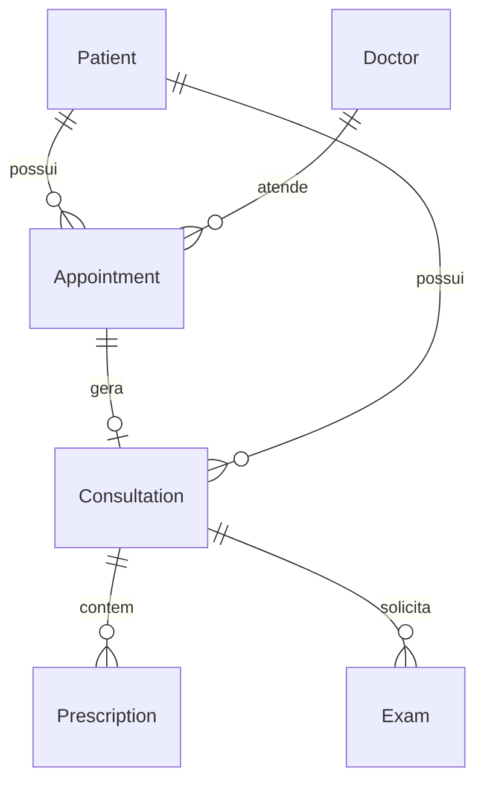

# Alma do Sistema

> Síntese executiva do projeto, gerada por reversa-extract-soul em 27/08/2026.
> Base: surface.json + amostragem leve de domínio + git log.

## 1. Propósito

O Prontuário Fácil é uma aplicação web (Single Page Application desenvolvida em React/Vite) que funciona como um prontuário eletrônico aderente à LGPD para clínicas médicas 🟢. Seu objetivo é prover a gestão completa e centralizada de pacientes, consultas, agendamentos e exames para médicos e administradores de clínicas 🟢. O valor principal é digitalizar o fluxo de atendimento médico com segurança e padronização através de uma arquitetura baseada em Backend as a Service (BaaS) utilizando a plataforma Base44 (com Supabase) 🟢.

## 2. Entidades centrais

- **Patient (Paciente):** Representa o paciente da clínica. 🟢
- **Doctor (Médico):** Representa o profissional de saúde que realiza o atendimento. 🟢
- **Appointment (Agendamento):** Registra a marcação de horários (dia/hora, status, tipo) entre o paciente e o médico. 🟢
- **Consultation (Consulta):** Armazena os dados clínicos do atendimento, como sinais vitais, diagnóstico e plano de tratamento. 🟢
- **Exam (Exame):** Registra os exames solicitados ou resultados associados ao paciente. 🟢
- **Prescription (Prescrição):** Representa as receitas geradas durante ou após a consulta. 🟢
- **Template (Modelo):** Modelos de formulários/documentos utilizados para acelerar os atendimentos médicos. 🟢

## 3. Decisões fundadoras

### D1. Adoção da plataforma Base44 (BaaS) com Supabase
- **Evidência:** `README.md` e pasta `base44/entities/`
- **Implicação:** O backend é 100% gerenciado como serviço (Backend as a Service), transferindo a responsabilidade de banco de dados, autorizações (RLS) e APIs CRUD para a plataforma Base44, inviabilizando um modelo tradicional de backend customizado (ex: Node.js/Express) para operações triviais.
- **Confiança:** 🟢

### D2. Arquitetura Frontend SPA (React + Vite)
- **Evidência:** `surface.json` (Frameworks: React, Vite)
- **Implicação:** O roteamento (`react-router-dom`) e estado da aplicação vivem inteiramente no cliente, demandando chamadas assíncronas (gerenciadas primariamente pelo `@tanstack/react-query`) para interação remota. Não há server-side rendering.
- **Confiança:** 🟢

### D3. UI centralizada com Tailwind CSS e Radix UI (shadcn)
- **Evidência:** `surface.json` (Frameworks: Tailwind CSS, Radix UI)
- **Implicação:** A estilização da interface e composição visual deve ser feita exclusivamente via classes utilitárias e componentes baseados em primitivas de acessibilidade, evitando a escrita de arquivos CSS/SCSS puros isolados por componente.
- **Confiança:** 🟢

### D4. Estruturação Híbrida de Módulos (Domain / Pages)
- **Evidência:** `surface.json` (`organization_suggestion`) e mapeamento de roteamento (`src/pages.config.js`)
- **Implicação:** Exige que desenvolvedores busquem e modifiquem rotas no config central, mas que encontrem a lógica e composição dos componentes separada estritamente por domínios de negócio (`components/appointments/`, `components/medical/`), ao invés de um padrão por tipo (ex: todos os modais em uma pasta).
- **Confiança:** 🟡

## 4. Lacunas

🔴 **Testes Automatizados:** Não foram detectados frameworks de teste no mapeamento inicial (`test_file_count: 0`). É preciso validar com o time se regras de negócio críticas (como gestão de permissões e agendamentos) estão dependendo exclusivamente de validação manual.

## 5. Como ler esse documento

Esse `soul.md` é uma síntese, não substitui:
- `inventory.md` (Scout) para mapeamento de superfície
- `code-analysis.md` (Archaeologist) para detalhes módulo a módulo
- `domain.md` (Detective) para regras de negócio implícitas
- `architecture.md` (Architect) para diagramas C4 e ERD completo
