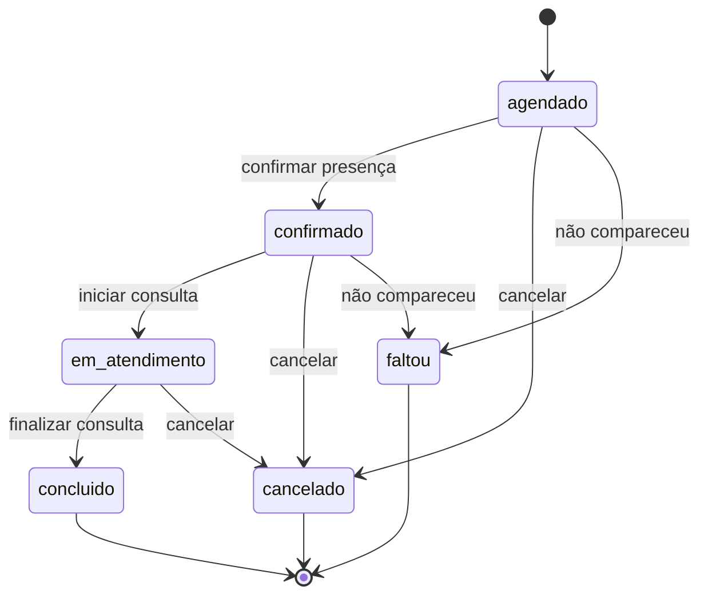
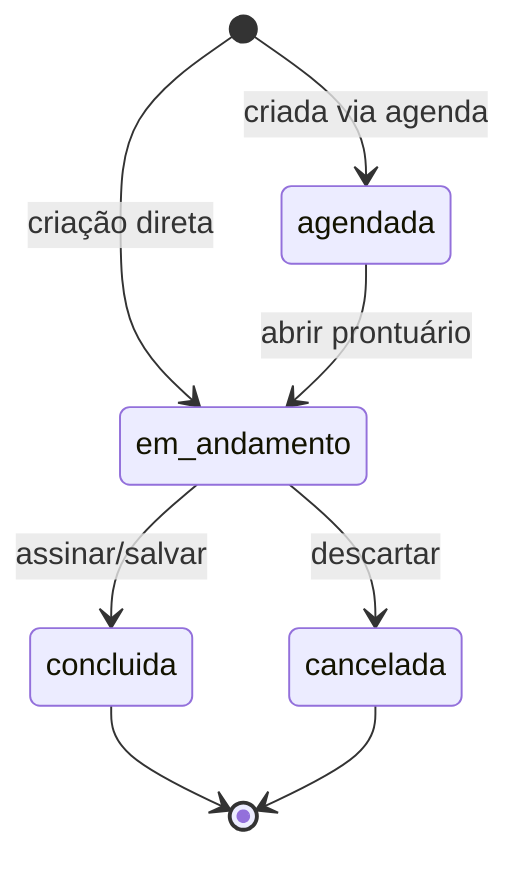
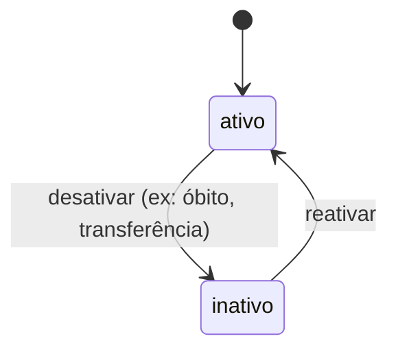

# Máquinas de Estado — prontuario-facil

## 1. Status de Agendamento (Appointment)

O fluxo de vida de um agendamento é o mais complexo do sistema, envolvendo confirmação e presença.

## 2. Status de Consulta (Consultation)

Diferente do agendamento, a consulta foca no progresso do preenchimento clínico.

## 3. Status de Paciente

## 4. Matriz de Transições (Inferida) 🟡

| De | Para | Gatilho | Validação |
| :--- | :--- | :--- | :--- |
| `agendado` | `confirmado` | Clique no Botão "Confirmar" | Nenhuma |
| `qualquer` | `cancelado` | Clique no Botão "Cancelar" | Exige confirmação de diálogo |
| `em_atendimento` | `concluido` | Mudança manual no Select | Nenhuma |
