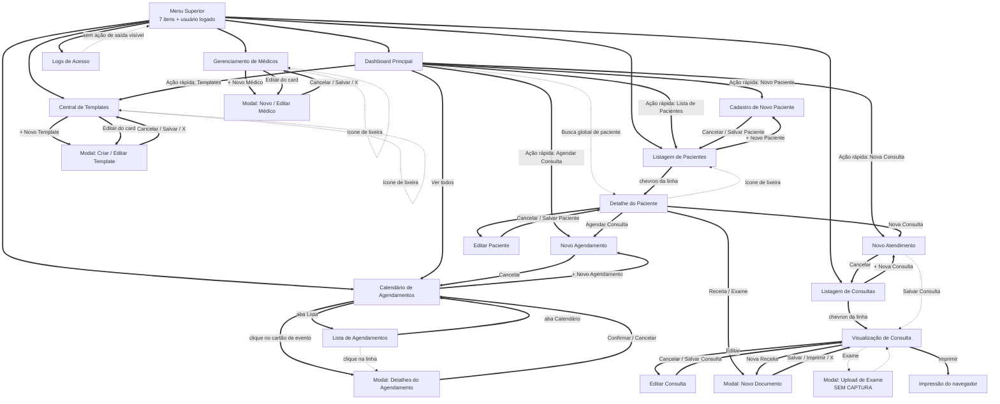

# Fluxo de Navegação — MedRecord

Fluxo principal identificado a partir das interfaces.

```mermaid
graph TD
    Dashboard[Dashboard Principal] -->|Botão Novo Paciente| NovoPaciente[Cadastro de Novo Paciente]
    Dashboard -->|Link Ver Todos / Menu| ListaPacientes[Listagem de Pacientes]
    Dashboard -->|Atalho / Menu| Agenda[Calendário de Agendamentos]
    Dashboard -->|Atalho / Menu| ListaConsultas[Listagem de Consultas]
    Dashboard -->|Atalho / Menu| ListaMedicos[Gerenciamento de Médicos]
    Dashboard -->|Atalho / Menu| ListaTemplates[Central de Templates]
    Dashboard -->|Menu Superior| LogsAcesso[Logs de Acesso]
    
    Menu[Menu Superior] --> Dashboard
    Menu --> ListaPacientes
    Menu --> Agenda
    Menu --> ListaConsultas
    Menu --> ListaMedicos
    Menu --> ListaTemplates
    Menu --> LogsAcesso
    
    ListaPacientes -->|Botão Novo Paciente| NovoPaciente
    ListaPacientes -->|Clique na Linha| DetalhePaciente[Detalhe do Paciente]
    
    NovoPaciente -->|Cancelar/Salvar| ListaPacientes
    NovoPaciente -->|Voltar| Dashboard
    
    Agenda -->|Botão Novo Agendamento| NovoAgendamento[Novo Agendamento]
    Agenda -->|Clique no Slot de Horário| NovoAgendamento
    
    NovoAgendamento -->|Cancelar/Confirmar| Agenda
    
    ListaConsultas -->|Botão Nova Consulta| NovoAtendimento[Novo Atendimento (Anamnese)]
    ListaConsultas -->|Clique na Linha| VerConsulta[Visualização de Consulta]
    
    NovoAtendimento -->|Salvar Consulta| VerConsulta
    
    VerConsulta -->|Botão Novo Documento / Receita| ModalDocumento[Modal: Novo Documento]
    VerConsulta -->|Botão Exame| ModalExame[Modal: Upload de Exame]
    VerConsulta -->|Botão Editar| NovoAtendimento
    
    ListaMedicos -->|Botão Novo Médico| ModalMedico[Modal: Novo Médico]
    ListaMedicos -->|Botão Editar| ModalMedico
    
    ListaTemplates -->|Botão Novo Template| ModalTemplate[Modal: Criar/Editar Template]
    ListaTemplates -->|Botão Editar| ModalTemplate
```

---
*Gerado pelo Reversa-Visor em 2026-08-27.*

---

## Fluxo revisado sobre as capturas — 2026-09-22

> Segunda passada do Visor. O diagrama acima foi preservado; o abaixo incorpora o que as **21 capturas** confirmam e o que elas não permitem observar.
> Convenção: **linha cheia** = transição com evidência visual na captura (botão, link ou aba visível na tela de origem). **linha tracejada** = transição inferida ou não observável na imagem.



### O que as capturas confirmaram

- **Menu superior com 7 itens** (Dashboard, Pacientes, Agendamentos, Consultas, Médicos, Templates, Logs de Acesso), com o item ativo destacado, presente em todas as telas capturadas. 🟢
- **Faixa LGPD** logo abaixo do menu, também global. 🟢
- **Telas de edição espelham as de criação**: Editar Paciente, Editar Consulta e Editar Médico reutilizam o mesmo formulário, mudando título, subtítulo e dados carregados. 🟢
- **Pacientes e Agendamentos têm tela de detalhe**; em Agendamentos o detalhe é um **modal** sobre a agenda, não uma página. 🟢
- **A partir do Detalhe do Paciente saem quatro ações clínicas**: Agendar Consulta, Nova Consulta, Receita e Exame. 🟢
- **Médicos e Templates concentram suas ações em modais** abertos pela própria listagem (criar e editar no mesmo modal). 🟢
- **Logs de Acesso é folha do fluxo**: nenhuma ação de navegação ou escrita é visível na tela. 🟢

### O que as capturas NÃO permitem afirmar

| # | Transição / comportamento | Por quê | Veredito |
|---|---|---|---|
| 1 | Calendário → Novo Agendamento por **clique em slot vazio** | Não há affordance de slot visível na grade capturada; e o formulário de Novo Agendamento não tem campo de data/hora | 🔴 revisar: se o horário só se define na grade, esta é a transição crítica do módulo |
| 2 | Lista de Agendamentos → detalhe ao **clicar na linha** | Não há botão nem chevron visível nas linhas da lista | 🔴 |
| 3 | Dashboard → detalhe do paciente pela **busca global** | O resultado da busca não foi capturado | 🔴 |
| 4 | Ícones de **lixeira** (Paciente, Médico, Template) → exclusão | Nenhuma captura de confirmação de exclusão | 🔴 |
| 5 | "Salvar" de Novo Atendimento → Visualização de Consulta | Não observável em imagem estática | 🟡 |
| 6 | "Imprimir" (Consulta e Modal de Documento) → impressão do navegador ou PDF | Não observável | 🟡 |
| 7 | Retorno do Modal "Upload de Exame" | Tela sem captura | 🔴 |
| 8 | Navegação pós-`login`/`logout` | Nenhuma captura de tela de autenticação | 🔴 — o fluxo de entrada do sistema não está documentado visualmente |

### Cobertura visual do fluxo

- Telas no fluxo com captura: **21 de 22**.
- Transições com evidência visual direta: **menu (7 itens)**, botões **primários de criação** em cada listagem, **abas** Calendário/Lista, **chevron** das listagens de Pacientes e Consultas, botões **Editar** (Paciente, Consulta, Médico, Template), **abas do Histórico** no Detalhe do Paciente, e **X / Cancelar / Salvar** dos modais.
- Transições sem evidência: as oito da tabela acima.

---
*Fluxo revisado pelo Reversa-Visor em 2026-09-22.*
