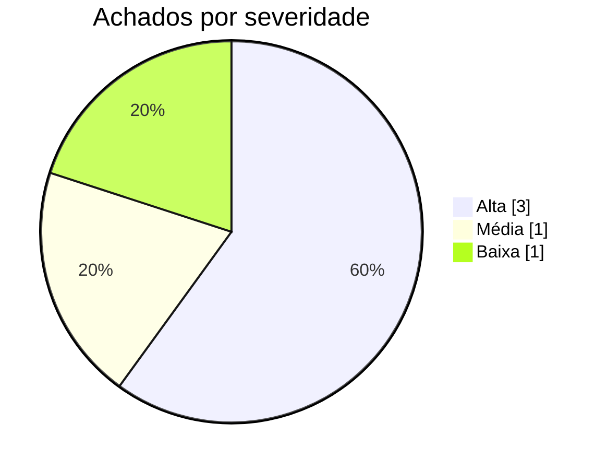

# Relatório de Auditoria de Segurança — Prontuário Fácil

**Data:** 04/09/2026  
**Escopo auditado:** Código-fonte completo (frontend React/Vite, SDK Base44, configs de ambiente e layout)

## Stack detectada
- **Linguagem:** JavaScript (ES6+) / React 18 / Node
- **Framework:** Vite + React Router DOM v7 + TanStack React Query v5
- **ORM:** Base44 SDK (Base44 Entity Framework)
- **Autenticação:** Base44 Auth SDK (base44.auth.me / access_token via URL & LocalStorage)
- **Frontend:** React 18 + TailwindCSS + Radix UI
- **Arquivos de deploy:** vite.config.js, .env.local

## Nota metodológica
A auditoria analisou o projeto Prontuário Fácil adaptando as 5 categorias à arquitetura BaaS/SaaS do Base44: (1) Isolamento Tenant/RLS: checado como o SDK Base44 lida com listagens e queries e a dependência de RLS backend; (2) Permissão no Navegador: verificado se as views/ações de admin (ex: listagem de logs de acesso, gerenciamento de médicos e templates, exclusão de conta) possuem guards de role ou se qualquer usuário autenticado pode acessá-las; (3) IDOR: auditadas buscas e mutations por ID (Patient, Consultation, Prescription, Exam) sem validação de posse no cliente; (4) Chaves Expostas: auditados .env.local, cliente SDK e passagem de tokens sensíveis via parâmetros de URL/LocalStorage; (5) XSS: auditados sinks HTML (dangerouslySetInnerHTML em componentes).

## Resumo executivo

| Severidade | Qtde |
|---|---|
| 🟠 Alta | 3 |
| 🟡 Média | 1 |
| 🔵 Baixa | 1 |
| **Total** | **5** |

| Categoria | Qtde |
|---|---|
| Banco sem tranca (isolamento de inquilino/dono) | 1 |
| Permissão definida no navegador | 1 |
| IDOR | 1 |
| Chaves expostas (hardcode) | 1 |
| Inputs sem tratamento (XSS) | 1 |

## Pontos fortes
- 🟢 **Autenticação e Sessão** (`src/lib/AuthContext.jsx`): Verificação centralizada do estado de autenticação via `base44.auth.me()` com tratamento de token expirado e direcionamento para página de login.
- 🟢 **Auditoria LGPD** (`src/components/medical/AccessLogger.js`): Registro sistemático de eventos de acesso (visualização de paciente, criação de consulta, exclusão de registro) para conformidade com a LGPD via `AccessLog`.
- 🟢 **Comunicação Segura SDK** (`src/api/base44Client.js`): Utilização do SDK oficial `@base44/sdk` com suporte a modo offline encapsulado para ambiente de desenvolvimento/testes.

## Pontos fracos (riscos centrais)
- Falta de controle de acesso baseado em funções (RBAC) no frontend para páginas de administração e auditoria (AccessLogs, Doctors, Templates).
- Tratamento de tokens de acesso passados na Query String da URL sem proteção contra vazamento por Referer ou histórico do navegador.
- Dependência total do isolamento de dados no backend BaaS (Base44) sem filtros de tenant declarativos no cliente para Patient, Consultation e Prescription.

## Achados detalhados por categoria
### Banco sem tranca (isolamento de inquilino/dono)
| Severidade | Arquivo:linha | Descrição |
|---|---|---|
| 🟡 Média | `src/pages/Dashboard.jsx:45-62` | Queries de listagem ampla em entidades críticas (Patient, Consultation, Prescription, Appointment) sem filtro explícito por organização ou tenant no frontend. |

### Permissão definida no navegador
| Severidade | Arquivo:linha | Descrição |
|---|---|---|
| 🟠 Alta | `src/Layout.jsx:40-48` | Menu de navegação e rotas sensíveis (Logs de Acesso, Médicos, Templates) expostas a todos os usuários sem verificação de privilégio/role de administrador no frontend. |

### IDOR
| Severidade | Arquivo:linha | Descrição |
|---|---|---|
| 🟠 Alta | `src/pages/PatientDetail.jsx:61-98` | Acesso direto a recursos de pacientes, exames, consultas e prescrições via parâmetro de URL (`id`) sem validação de permissão de posse no frontend. |

### Chaves expostas (hardcode)
| Severidade | Arquivo:linha | Descrição |
|---|---|---|
| 🟠 Alta | `src/lib/app-params.js:38-48` | Recebimento de token de acesso sensível via parâmetro de URL (`access_token`) sem remoção imediata da URL nem proteção contra vazamento por cabeçalho Referer/histórico. |

### Inputs sem tratamento (XSS)
| Severidade | Arquivo:linha | Descrição |
|---|---|---|
| 🔵 Baixa | `src/components/ui/chart.jsx:74-89` | Uso do sink perigoso `dangerouslySetInnerHTML` para injeção de CSS em runtime dentro do componente de gráficos. |

## Recomendações priorizadas
**P1 — Implementar controle de acesso baseado em roles (RBAC) no Layout e nas rotas sensíveis**  
Restringir o acesso a `AccessLogs`, `Doctors` e `Templates` apenas a usuários com o papel 'admin' no `Layout.jsx` e criar uma guarda de rota no frontend.

**P1 — Eliminar o envio de access_token via parâmetros de URL**  
Modificar a estratégia de autenticação para utilizar cookies seguros SameSite HTTP-Only ou armazenamento seguro na memória/sessionStorage.

**P2 — Reforçar RLS / Isolamento de tenant no backend Base44 e adicionar filtros explícitos no SDK**  
Auditar as políticas de entidade no Base44 para garantir que requisições por ID (`Patient.filter({ id })`) ou listagens (`Patient.list()`) retornem apenas dados pertencentes ao médico/clínica autenticado.

**P3 — Sanitizar inputs dinâmicos em componentes UI de estilo**  
Substituir o uso de `dangerouslySetInnerHTML` em `src/components/ui/chart.jsx` por injeção segura de estilos ou CSS custom properties.

## Issues para o GitHub

--- ISSUE 1 ---
### [Segurança] Exposição de rotas administrativas e de auditoria para usuários não-admin

**Labels sugeridas:** `security`, `alta`, `rbac`

**Descrição**
Qualquer usuário autenticado tem acesso aos links e às páginas de 'Logs de Acesso', 'Médicos' e 'Templates', permitindo visualização de auditoria LGPD sem privilégios.

**Evidência**
`src/Layout.jsx:40-48` — `NAV_ITEMS` inclui `AccessLogs`, `Doctors` e `Templates` incondicionalmente.

**Impacto**
Usuários comuns podem visualizar logs de auditoria contendo e-mails e ações de outros usuários e dados de pacientes.

**Sugestão de correção**
Verificar `user?.role === 'admin'` antes de renderizar os itens no menu e bloquear a navegação direta dentro de `AccessLogs.jsx`.

**Critérios de aceite**
- [ ] Usuários comuns não veem os itens 'Logs de Acesso', 'Médicos' e 'Templates' no menu.
- [ ] Acesso direto via URL para /AccessLogs redireciona usuários não autorizados.
--- FIM ISSUE 1 ---

--- ISSUE 2 ---
### [Segurança] Possível vazamento de token de autenticação via Query String de URL

**Labels sugeridas:** `security`, `alta`, `auth`

**Descrição**
A função `getAppParamValue` lê `access_token` diretamente dos parâmetros de busca da URL, podendo expor credenciais no histórico do navegador e no cabeçalho Referer.

**Evidência**
`src/lib/app-params.js:38-48` — `urlParams.get('access_token')` salva o token sem removê-lo por padrão em todas as chamadas.

**Impacto**
Comprometimento da conta do usuário se a URL com token for compartilhada ou registrada em logs de tráfego/proxy.

**Sugestão de correção**
Remover o token da barra de endereço imediatamente após a leitura e migrar o fluxo de autenticação para mecanismos seguros sem query string.

**Critérios de aceite**
- [ ] O parâmetro `access_token` é limpo da URL instantaneamente no carregamento da página.
- [ ] Tokens não são persistidos em URLs ou links compartilháveis.
--- FIM ISSUE 2 ---

--- ISSUE 3 ---
### [Segurança] Verificação de políticas de posse (IDOR) e isolamento de tenant para entidades médicas

**Labels sugeridas:** `security`, `alta`, `idor`, `tenant-isolation`

**Descrição**
As chamadas `Patient.filter({ id })` e `Patient.list()` confiam unicamente na filtragem por ID ou retornam todos os registros sem validação de escopo de tenant no frontend.

**Evidência**
`src/pages/PatientDetail.jsx:68-98` e `src/pages/Dashboard.jsx:45-62` — chamadas diretas ao SDK Base44.

**Impacto**
Acesso não autorizado a dados de saúde de pacientes de outros médicos ou clínicas caso as políticas de segurança no BaaS estejam frouxas.

**Sugestão de correção**
Revisar as regras de acesso a entidades (Entity Policies) no console do Base44 para garantir RLS rigoroso.

**Critérios de aceite**
- [ ] Requisições de filtro por ID de outro tenant retornam erro 403 / lista vazia no backend.
- [ ] Listagens globais retornam estritamente registros do usuário/tenant logado.
--- FIM ISSUE 3 ---
