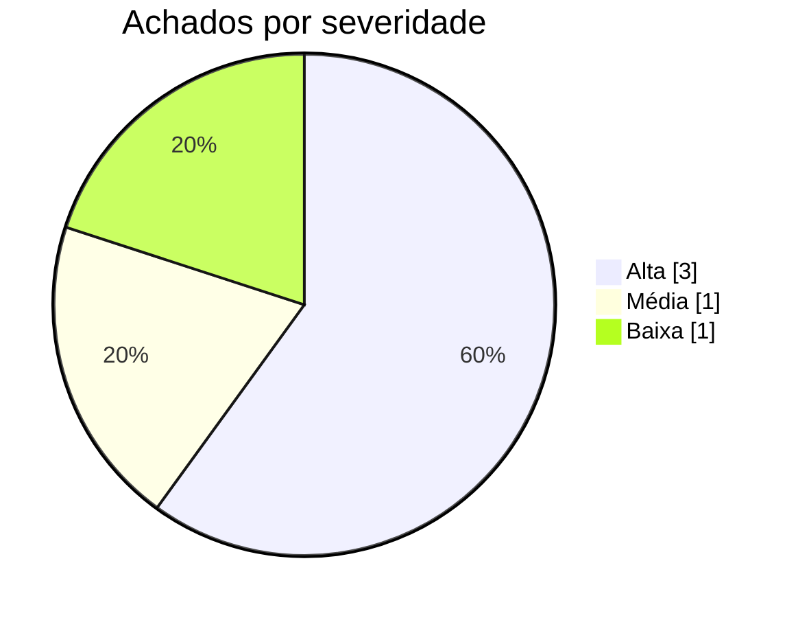

# Relatório de Auditoria de Segurança — Prontuário Fácil

**Data:** 16/09/2026  
**Escopo auditado:** Código-fonte completo pós-migração TypeScript (frontend React/Vite, camada de domínio tipada com ScopedReader/sessionScope, SDK Base44, configs de ambiente e layout)

## Stack detectada
- **Linguagem:** TypeScript 5.8 / JavaScript (ES6+) / React 18 / Node 22
- **Framework:** Vite 6 + React Router DOM v7 + TanStack React Query v5
- **ORM:** Base44 SDK (@base44/sdk) com camada de repositório tipada (ScopedReader / OwnedEntity)
- **Autenticação:** Base44 Auth SDK (base44.auth.me / access_token via URL & LocalStorage)
- **Frontend:** React 18 + TailwindCSS 3.4 + Radix UI + Lucide React + Framer Motion
- **Arquivos de deploy:** vite.config.js, .env.local, tsconfig.json

## Nota metodológica
A auditoria analisou o projeto Prontuário Fácil adaptando as 5 categorias à arquitetura pós-migração TypeScript com camada de escopo de domínio (scopedRead.ts e sessionScope.ts): (1) Banco sem tranca / Isolamento Tenant/RLS: checada a eficácia da camada OwnedEntity nas listagens clínicas (Patient, Consultation, Prescription, Appointment, Exam) e a exposição de entidades com leitura aberta como AccessLog.list(...) e dados do modo offline; (2) Permissão no Navegador: verificado se as views/ações de admin (AccessLogs.tsx, Doctors.tsx, Templates.tsx) possuem guards de rota ou de renderização de botões (role === 'admin') ou se continuam acessíveis a qualquer usuário autenticado; (3) IDOR: auditadas buscas e mutações por ID (Patient.delete, Appointment.update, Patient.update, etc.) e verificado onde o escopo de ownership no cliente foi introduzido e onde mutações ainda dependem exclusivamente de RLS no backend; (4) Chaves Expostas: auditados .env.local, cliente SDK e passagem de credenciais/tokens de acesso sensíveis via parâmetros de URL/LocalStorage em app-params.ts; (5) XSS: auditados sinks HTML (dangerouslySetInnerHTML em src/components/ui/chart.jsx) e tratamento de templates dinâmicos.

## Resumo executivo

| Severidade | Qtde |
|---|---|
| 🟠 Alta | 3 |
| 🟡 Média | 1 |
| 🔵 Baixa | 1 |
| **Total** | **5** |



| Categoria | Qtde |
|---|---|
| Banco sem tranca (isolamento de inquilino/dono) | 1 |
| Permissão definida no navegador | 1 |
| IDOR | 1 |
| Chaves expostas (hardcode) | 1 |
| Inputs sem tratamento (XSS) | 1 |

## Pontos fortes
- 🟢 **Isolamento Tipado de Ownership** (`src/api/scopedRead.ts`): Introdução do padrão `OwnedEntity` e `resolveScope(user)`, garantindo em tempo de compilação que leituras de `Patient`, `Consultation`, `Appointment`, `Prescription` e `Exam` apliquem o filtro `created_by_id: user.id` para usuários comuns.
- 🟢 **Auditoria LGPD Estruturada** (`src/components/medical/AccessLogger.ts`): Registro sistemático de eventos de acesso (visualização de paciente, criação de consulta, upload de exame, exclusão) para conformidade com a LGPD com isolamento de falha (erros de log não travam a UI).
- 🟢 **Sanitização de Sessão e Papéis** (`src/lib/session.ts`): Conversão segura do usuário de sessão com validação estrita de papéis permitidos (`['admin', 'user']`), rejeitando papéis desconhecidos de forma conservadora.
- 🟢 **Consentimento de Privacidade** (`src/components/medical/LGPDConsent.tsx`): Componente explícito de coleta e confirmação de termo de consentimento LGPD antes do cadastro do paciente.

## Pontos fracos (riscos centrais)
- Menu de navegação e rotas administrativas (Logs de Acesso, Médicos, Templates) expostas a todos os usuários sem verificação de privilégio de administrador no frontend.
- Tráfego de token de acesso sensível na Query String da URL (?access_token=...) e armazenamento em LocalStorage vulnerável a XSS.
- Mutações de alteração e exclusão (Patient.delete, Appointment.update, Patient.update) executadas por ID direto sem validação de posse no cliente.
- Consulta ampla de até 500 registros da trilha de auditoria LGPD sem filtro de escopo ou restrição de role no cliente.
- Uso de dangerouslySetInnerHTML para injeção de CSS em tempo de execução no componente de gráficos.

## Achados detalhados por categoria
### Banco sem tranca (isolamento de inquilino/dono)
| Severidade | Arquivo:linha | Descrição |
|---|---|---|
| 🟡 Média | `src/pages/AccessLogs.tsx:75-78` | Consulta aberta de listagem ampla em trilha de auditoria LGPD (AccessLog) sem filtro de tenant ou escopo de usuário no frontend. |

### Permissão definida no navegador
| Severidade | Arquivo:linha | Descrição |
|---|---|---|
| 🟠 Alta | `src/Layout.tsx:41-49` | Menu de navegação e rotas administrativas ('Logs de Acesso', 'Médicos' e 'Templates') expostas a todos os usuários sem verificação de privilégio ou papel de administrador (role === 'admin') no frontend. |

### IDOR
| Severidade | Arquivo:linha | Descrição |
|---|---|---|
| 🟠 Alta | `src/pages/PatientDetail.tsx:174-176` | Mutações de exclusão e alteração de entidades clínicas (Patient, Appointment, PatientForm) invocadas diretamente por ID sem validação de escopo de posse no cliente. |

### Chaves expostas (hardcode)
| Severidade | Arquivo:linha | Descrição |
|---|---|---|
| 🟠 Alta | `src/lib/app-params.ts:52-63` | Recepção de token de acesso sensível via parâmetro de consulta de URL ('access_token') e persistência do token em LocalStorage. |

### Inputs sem tratamento (XSS)
| Severidade | Arquivo:linha | Descrição |
|---|---|---|
| 🔵 Baixa | `src/components/ui/chart.jsx:73-89` | Injeção dinâmica de folhas de estilo em tempo de execução através do sink perigoso 'dangerouslySetInnerHTML'. |

## Recomendações priorizadas
**P1 — Implementar controle de acesso baseado em papéis (RBAC) no Layout e nas rotas sensíveis**  
Ocultar os itens 'Logs de Acesso', 'Médicos' e 'Templates' no Layout.tsx para usuários não-admin e adicionar uma guarda de rota protegida (ProtectedRoute/RoleGuard) no App.tsx.

**P1 — Eliminar o envio de access_token via parâmetros de URL e armazenamento em LocalStorage**  
Modificar a estratégia de autenticação para utilizar cookies seguros SameSite HttpOnly ou fluxo OAuth com PKCE mantendo tokens apenas em memória.

**P2 — Reforçar validação de escopo em mutações e blindar regras de RLS no backend**  
Estender a camada de domínio para validação prévia de posse em operações de exclusão/atualização e auditar políticas de Entity RLS no Base44 contra mutações cross-tenant.

**P2 — Restringir acesso e aplicar filtro de tenant na trilha de auditoria LGPD**  
Configurar a leitura da entidade AccessLog para exigir explicitamente permissão de administrador no cliente e na RLS do backend.

**P3 — Sanitizar injeção de estilos no componente de gráficos**  
Substituir o uso de dangerouslySetInnerHTML em src/components/ui/chart.jsx por CSS Custom Properties nativas aplicadas diretamente no elemento.

## Issues para o GitHub

--- ISSUE 1 ---
### [Segurança] Exposição de rotas e menus administrativos para usuários não-admin

**Labels sugeridas:** `security`, `alta`, `rbac`

**Descrição**
Qualquer usuário autenticado tem acesso aos links e às páginas de 'Logs de Acesso', 'Médicos' e 'Templates', permitindo visualização de histórico de auditoria LGPD e manipulação de cadastros sem papel de administrador.

**Evidência**
`src/Layout.tsx:41-49`
```typescript
const NAV_ITEMS = [
    { name: 'Dashboard', icon: LayoutDashboard, page: 'Dashboard' },
    { name: 'Pacientes', icon: Users, page: 'Patients' },
    { name: 'Agendamentos', icon: Calendar, page: 'Appointments' },
    { name: 'Consultas', icon: Stethoscope, page: 'Consultations' },
    { name: 'Médicos', icon: UserCog, page: 'Doctors' },
    { name: 'Templates', icon: FileText, page: 'Templates' },
    { name: 'Logs de Acesso', icon: Shield, page: 'AccessLogs' },
];
```

**Impacto**
Usuários sem privilégios administrativos podem acessar áreas sensíveis do sistema, visualizar dados de conformidade e auditoria de outros profissionais e acionar interfaces de edição/exclusão.

**Sugestão de correção**
Condicionar a renderização dos itens administrativos em `NAV_ITEMS` à verificação de `user?.role === 'admin'` e implementar um wrapper `ProtectedRoute` nas rotas correspondentes em `App.tsx`.

**Critérios de aceite**
- [ ] Itens 'Médicos', 'Templates' e 'Logs de Acesso' visíveis no menu apenas para usuários com role 'admin'
- [ ] Tentativa de acesso direto via URL às rotas /AccessLogs, /Doctors e /Templates por usuário comum redireciona para o Dashboard com aviso de permissão negada
--- FIM ISSUE 1 ---

--- ISSUE 2 ---
### [Segurança] Token de acesso sensível recebido via Query String da URL e armazenado em LocalStorage

**Labels sugeridas:** `security`, `alta`, `auth`

**Descrição**
A aplicação captura tokens de autenticação passados como parâmetro na URL ('?access_token=...') e os persiste no LocalStorage, possibilitando vazamento via histórico, logs intermediários e cabeçalho Referer.

**Evidência**
`src/lib/app-params.ts:52-63`
```typescript
const urlParams = new URLSearchParams(window.location.search);
const searchParam = urlParams.get(paramName);
if (removeFromUrl) {
    urlParams.delete(paramName);
    const newUrl = `${window.location.pathname}${urlParams.toString() ? `?${urlParams.toString()}` : ""
    }${window.location.hash}`;
    window.history.replaceState({}, document.title, newUrl);
}
if (searchParam) {
    storage.setItem(storageKey, searchParam);
    return searchParam;
}
```

**Impacto**
Comprometimento de credenciais de acesso caso o link seja compartilhado, gravado em logs de proxies ou acessado em computadores compartilhados. Além disso, tokens em LocalStorage são vulneráveis a roubo via ataques XSS.

**Sugestão de correção**
Migrar o fluxo de autenticação para o padrão OAuth PKCE com cookies seguros HttpOnly SameSite ou manter o token exclusivamente na memória de execução.

**Critérios de aceite**
- [ ] A aplicação não aceita nem processa access_token a partir de parâmetros de URL
- [ ] Tokens de acesso não são persistidos em LocalStorage em texto puro
--- FIM ISSUE 2 ---

--- ISSUE 3 ---
### [Segurança] Risco de IDOR em operações de mutação (exclusão e atualização) de entidades clínicas

**Labels sugeridas:** `security`, `alta`, `idor`

**Descrição**
As mutações de exclusão (delete) e atualização (update) de entidades como Patient e Appointment operam diretamente por ID sem validação de posse no cliente, dependendo exclusivamente de regras de backend.

**Evidência**
`src/pages/PatientDetail.tsx:174-176`
```typescript
const deleteMutation = useMutation({
    mutationFn: () => base44.entities.Patient.delete(patientId ?? ''),
});
```
`src/pages/Appointments.tsx:83-84`
```typescript
const updateStatusMutation = useMutation({
    mutationFn: ({ id, status }: { id: string; status: AppointmentStatus }) =>
        base44.entities.Appointment.update(id, { status }),
});
```

**Impacto**
Caso as políticas de RLS do backend Base44 contenham brechas ou estejam permissivas, um atacante autenticado pode alterar ou deletar pacientes e consultas de outros médicos manipulando o ID.

**Sugestão de correção**
Verificar se as regras de Row-Level Security no backend BaaS restringem operações de escrita e exclusão por created_by_id, e tratar exceções de permissão negada no frontend de forma amigável.

**Critérios de aceite**
- [ ] Tentativas de atualizar ou excluir registros com ID pertencente a outro médico/tenant são rejeitadas pelo backend
- [ ] O frontend trata o erro de permissão e informa ao usuário que a ação não é autorizada
--- FIM ISSUE 3 ---

--- ISSUE 4 ---
### [Segurança] Listagem ampla e irrestrita de registros da trilha de auditoria LGPD (AccessLogs)

**Labels sugeridas:** `security`, `media`, `lgpd`

**Descrição**
A página de logs de acesso executa AccessLog.list('-created_date', 500) sem qualquer filtro de organização ou tenant no cliente, trazendo histórico detalhado de ações de usuários.

**Evidência**
`src/pages/AccessLogs.tsx:75-78`
```typescript
const { data: logs, isLoading } = useQuery({
    queryKey: ['access-logs'],
    queryFn: () => base44.entities.AccessLog.list('-created_date', 500),
});
```

**Impacto**
Exposição de histórico de visualizações de prontuários, nomes de pacientes, emails de médicos e endereços IP de múltiplos usuários se o backend não aplicar filtro rígido por tenant.

**Sugestão de correção**
Exigir escopo administrativo explícito para a leitura de AccessLog e assegurar que a query passe parâmetros de tenant/organização.

**Critérios de aceite**
- [ ] A consulta de logs de acesso exige papel 'admin'
- [ ] Apenas logs pertencentes à organização do usuário autenticado são retornados
--- FIM ISSUE 4 ---

--- ISSUE 5 ---
### [Segurança] Injeção dinâmica de CSS com dangerouslySetInnerHTML no componente Chart

**Labels sugeridas:** `security`, `baixa`, `xss`

**Descrição**
O componente de gráficos utiliza dangerouslySetInnerHTML para renderizar dinamicamente regras CSS dentro de tags <style> no DOM.

**Evidência**
`src/components/ui/chart.jsx:73-89`
```javascript
<style
  dangerouslySetInnerHTML={{
    __html: Object.entries(THEMES)
      .map(([theme, prefix]) => `
${prefix} [data-chart=${id}] {
${colorConfig
.map(([key, itemConfig]) => {
const color =
  itemConfig.theme?.[theme] ||
  itemConfig.color
return color ? `  --color-${key}: ${color};` : null
})
.join("\n")}
}
`)
      .join("\n"),
  }} />
```

**Impacto**
Risco residual de injeção de CSS caso propriedades de configuração do gráfico recebam futuramente valores não sanitizados controlados pelo usuário.

**Sugestão de correção**
Substituir a injeção via tag <style> por CSS Variables aplicadas diretamente no elemento do gráfico via atributo style inline.

**Critérios de aceite**
- [ ] Remoção de dangerouslySetInnerHTML do componente src/components/ui/chart.jsx
- [ ] Gráficos continuam renderizando suas cores e temas normalmente
--- FIM ISSUE 5 ---
